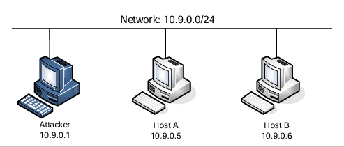
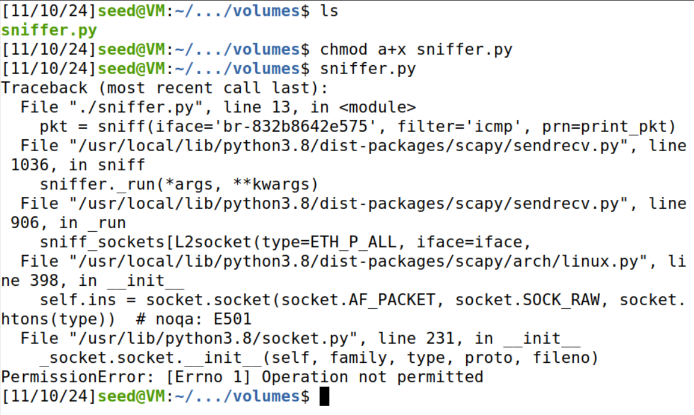

# Packet Sniffing and Spoofing

## Experimental Principle

数据包嗅探和欺骗是网络安全中的两个重要概念；它们是网络通信中的两大威胁。能够理解这两种威胁对于理解网络中的安全措施至关重要。有许多数据包嗅探和欺骗工具，例如 Wireshark、 Tcpdump、Netwox、Scapy 等。其中一些工具被安全专家和攻击者广泛使用。能够使用这些工具对学生来说很重要，但对于网络安全课程的学生来说，更重要的是了解这些工具的工作原理，即如何在软件中实现数据包嗅探和欺骗。

## Environment Setup using Container

本次实验采用`docker-compose`配置文件搭建了一个具有 $3$ 台容器的网络，如图：



首先，进入`Labsetup`文件夹，构建并启动容器，同时使其后台运行：


```bash
dcbuild                 //根据docker-compose配置文件构建容器
dcup -d				    //启动容器并后台运行
```

为了方便观察，我们打开三个终端并分别进入容器


```
docker exec -it seed-attacker-sniff /bin/bash
docker exec -it hostA-10.9.0.5-sniff /bin/bash
docker exec -it hostB-10.9.0.6-sniff /bin/bash
```

---


##  LabTaskSet1: Using Scapy to Sniff and Spoof Packets

### Task 1.1: Sniffing Packets

查看网口：


编写 `sniffer.py`：

```python
#!/usr/bin/env python3
from scapy.all import *

def print_pkt(pkt):
    # 检查数据包是否具有 IP 层
    if IP in pkt:
        src_ip = pkt[IP].src       # 源 IP 地址
        dst_ip = pkt[IP].dst       # 目的 IP 地址
        pkt_type = pkt.summary()   # 包类型的简要描述
        print(f"Source IP: {src_ip}, Destination IP: {dst_ip}, Packet Type: {pkt_type}")

# 嗅探 ICMP 数据包
pkt = sniff(iface='br-832b8642e575', filter='icmp', prn=print_pkt)
```

`br-832b8642e575` 即为 docker 网络的网口。

---


#### Task 1.1A

添加权限，首先以 $root$ 权限运行程序，同时在 $attacker-10.9.0.1$ 上`ping` $hostA-10.9.0.5$ ：


```bash
chmod a+x sniffer.py
sudo ./sniffer.py
```

运行成功，打印出了准确的信息。

再以普通用户权限运行`sniffer.py`：



失败了，显示无权限，这说明嗅探包是一件拥有高权限才能做的事情。

---


#### Task 1.1B

通常，当我们嗅探数据包时，我们只对某些类型的数据包感兴趣。我们可以通过设置嗅探中的过滤器来实现这一点。Scapy 的过滤器使用 BPF（BerkeleyPacketFilter）语法；您可以从 Internet 上找到 BPF 手册。请设置以下过滤器并再次演示您的嗅探程序（每个过滤器应单独设置）：

- 仅捕获 ICMP 数据包 

依旧是上面的程序，这次我们在 $hostA$ 上`ping baidu.com`，在 $hostB$ 上`telnet attacker`：


 可以看到仅仅嗅探到了 ICMP 包。

- 捕获来自特定 IP 且目标端口号为 23 的任何 TCP 数据包。

修改程序，并重新命名为`sniffer2.py`：

```python
#!/usr/bin/env python3
from scapy.all import *

def print_pkt(pkt):
    # 检查数据包是否具有 IP 层
    if IP in pkt:
        src_ip = pkt[IP].src       # 源 IP 地址
        dst_ip = pkt[IP].dst       # 目的 IP 地址
        pkt_type = pkt.summary()   # 包类型的简要描述
        print(f"Source IP: {src_ip}, Destination IP: {dst_ip}, Packet Type: {pkt_type}")

# 捕获来自特定 IP 且目标端口号为 23 的任何 TCP 数据包
pkt = sniff(iface='br-832b8642e575', filter='src host 10.9.0.6 and tcp dst port 23', prn=print_pkt)
```

运行 `sniffer2.py`，同时在 $hostB$ 上 `telnet attacker`：


- 捕获来自或发往特定子网的数据包。您可以选择任何子网，例如 128.230.0.0/16；您不应该选择您的 VM 所连接的子网。

修改程序，并重新命名为 `sniffer3.py`：

```python
#!/usr/bin/env python3
from scapy.all import *

def print_pkt(pkt):
    # 检查数据包是否具有 IP 层
    if IP in pkt:
        src_ip = pkt[IP].src       # 源 IP 地址
        dst_ip = pkt[IP].dst       # 目的 IP 地址
        pkt_type = pkt.summary()   # 包类型的简要描述
        print(f"Source IP: {src_ip}, Destination IP: {dst_ip}, Packet Type: {pkt_type}")

# 捕获来自或发往特定子网的数据包
pkt = sniff(iface='br-832b8642e575', filter='net 128.230.0.0/16', prn=print_pkt)

```

这次我们在 $hostA$ 上 `ping attacker`，在 $hostB$ 上 `ping 128.230.0.1`：


可以看见只捕获了发往 $128.230.0.1$ 的数据包。

---


### Task 1.2: Spoofing ICMP Packets

作为数据包欺骗工具，Scapy 允许我们将 IP 数据包的字段设置为任意值。

此任务的目标是使用任意源 IP 地址欺骗 IP 数据包。我们将欺骗 ICMP 回显请求数据包，并将其发送到同一网络上的另一个 VM。

我们将使用 Wireshark 来观察接收方是否会接受我们的请求。如果被接受，将向欺骗性的 IP 地址发送回声回复数据包。

我们创建 `spoofing.py`用于 *attacker* 向 $hostA$ 发包：

```python
#!/usr/bin/env python3
from scapy.all import *  

# 构造 IP 层
a = IP()
a.src = '10.9.0.1'  # 设置源 IP 地址为 10.9.0.1
a.dst = '10.9.0.5'  # 设置目的 IP 地址为 10.9.0.5

# 构造 ICMP 层
b = ICMP()  # 创建一个 ICMP Echo Request（ping）包

# 构造完整的数据包
p = a / b  # 将 IP 层和 ICMP 层组合成一个完整的数据包

# 发送数据包
send(p)  # 发送数据包，从 10.9.0.1 到 10.9.0.5

```

启动 $wireshark$ 准备抓包：


在 $attacker$ 上运行`spoofing.py`发包：


查看抓包结果：


可以看到 $hostA$ 向 $attacker$ 发送了回复数据包，欺骗成功。

---


### Task 1.3: Traceroute

此任务的目标是使用 Scapy 估计 VM 与所选目标之间的距离（以路由器数量为单位）。这基本上就是 traceroute 工具实现的。

- 在这个任务中，我们将编写自己的工具。这个想法非常简单：
- 只需将数据包（任何类型）发送到目的地，其生存时间 （TTL） 字段首先设置为 1。
- 第一个路由器将丢弃此数据包，该路由器将向我们发送一条 ICMP 错误消息，告诉我们已超过生存时间。这就是我们获取第一个路由器的 IP 地址的方式。
- 然后我们将 TTL 字段增加到 2，发送另一个数据包，并获取第二个路由器的 IP 地址。

我们将重复此过程，直到我们的数据包最终到达目的地。需要注意的是，这个实验只得到一个估计的结果。

因为从理论上讲，并不是所有的这些数据包都采用相同的路由（但在实践中，它们可能会在短时间内出现）。

我们编写程序 `traceroute.py`：

```python
#!/usr/bin/env python3
from scapy.all import *  
import time  
import sys  

def traceroute(target_ip, max_hops=30):
    print(f"Traceroute to {target_ip} with max {max_hops} hops:")
    
    for ttl in range(1, max_hops + 1):  # 从1到max_hops逐步增加ttl值
        packet = IP(dst=target_ip, ttl=ttl) / ICMP()  # 创建 IP 和 ICMP 层
        
        start_time = time.time()  # 记录开始时间
        response = sr1(packet, verbose=0, timeout=2)  # 发送数据包并等待响应
        
        elapsed_time = (time.time() - start_time) * 1000  # 计算响应时间（毫秒）
        
        if response is None:
            print(f"{ttl} * * * Request timed out.")  # 未响应
        else:
            print(f"{ttl} {response.src} {elapsed_time:.2f} ms")  # 打印响应信息
            
            if response.src == target_ip:
                print("Trace complete.")
                break

# 主程序部分
if __name__ == "__main__":
    # 检查命令行参数是否正确
    if len(sys.argv) != 2:
        print("Usage: python3 traceroute.py <target_ip>")
        sys.exit(1)

    # 从命令行读取目标 IP 地址
    target_ip = sys.argv[1]
    
    # 调用 traceroute 函数
    traceroute(target_ip)

```

我们运行程序，并设置目标地址为 $8.8.8.8$ :


没有问题。

---


### Task 1.4: Sniffing and-then Spoofing

在此任务中，您将结合探查和欺骗技术来实现以下 sniff-and then-spoof 程序。

您需要在同一个 LAN 上使用两台计算机：VM 和用户容器。

从用户容器中，ping IP X。这将生成 ICMP 回显请求数据包。如果 X 处于活动状态，则 ping 程序将收到 echo 回复，并打印出响应。

您的嗅探然后欺骗程序在 VM 上运行，VM 通过数据包嗅探来监视 LAN。每当它看到 ICMP 回声请求时，无论目标 IP 地址是什么，您的程序都应该立即使用数据包欺骗技术发出回声回复。

因此，无论机器 X 是否存活，ping 程序总是会收到回复，表明 X 是存活的。

您需要使用 Scapy 来完成此任务。在您的报告中，您需要提供证据来证明您的技术有效。在实验中，您应该从用户容器 ping 以下三个 IP 地址。报告您的观察结果并解释结果：

```bash
 ping 1.2.3.4         # a non-existing host on the Internet
 ping 10.9.0.99 	  # a non-existing host on the LAN
 ping 8.8.8.8         # an existing host on the Internet
```

按照实验要求我们编写 `sniff_and_spoof.py`：

```python
#!/usr/bin/env python3
from scapy.all import *
import time

def spoof_icmp_reply(packet):
    # 检查是否是 ICMP Echo 请求
    if packet.haslayer(ICMP) and packet[ICMP].type == 8:  # ICMP type 8 是 Echo 请求
        # 获取源 IP 和目的 IP
        src_ip = packet[IP].src
        dst_ip = packet[IP].dst

        # 构造 ICMP Echo 回复包
        reply_packet = IP(src=dst_ip, dst=src_ip) / ICMP(type=0, id=packet[ICMP].id, seq=packet[ICMP].seq) / packet[Raw].load
        
        # 发送伪造的 Echo 回复包
        send(reply_packet, verbose=0)
        print(f"Sent spoofed ICMP Echo reply to {src_ip} from {dst_ip}")

def sniff_and_spoof():
    # 开始嗅探 ICMP 数据包并调用 spoof_icmp_reply 进行欺骗
    sniff(filter="icmp", prn=spoof_icmp_reply, store=0)

if __name__ == "__main__":
    print("Starting ICMP sniffer and spoofer...")
    sniff_and_spoof()

```

在 VM上运行 `sniff_and_spoof.py`：


> 接下来在 $hostA$上 `ping 1.2.3.4`：

我们先分析一下过程：首先 *1.2.3.4* 是一个不存在的外部ip，`ping 1.2.3.4` 无疑是`ping`不通的，

但当`Echo request`包发出时会被 VM 上运行的`sniff_and_spoof.py`所捕获，伪造并发出`reply`给 *hostA*，

*hostA* 会接受该回复包，`ping 1.2.3.4`会显示能`ping`通。

但实验进行时出现了与预期结果不符的结果，如图：


伪造的`Echo reply`包是从 $10.0.2.13$ 发出，而不是 $hostA-10.9.0.5$。

经过分析得知是发往局域网外的`request`包经过了`NAT`转换的原因，于是我们指定网口为`br-832b8642e575`。

```python
    sniff(iface='br-832b8642e575', filter="icmp", prn=spoof_icmp_reply, store=0)
```

再次实验：


可以看到`hostA ping 1.2.3.4`成功了，`VM`这边也与预期结果相符。

> 接下来在`hostA`上`ping 10.9.0.99`：

我们可以看到出现了如下结果：


我们可以查看`ip route`来解释这一现象：


可以看到，`10.9.0.99`是子网内部的，不经过网关，然而没有找到该地址，所以两边都没有结果。

最后我们在`hostA`上`ping 8.8.8.8`：

这是局域网外一个存在并存活的`ip`，预期结果是`hostA`既会收到来自`VM`的欺骗回复，也会收到正常`ping 8.8.8.8`的回复。


如图可以看到欺骗成功，`hostA`收到了两份回复，`DUP！`表示回复重复。

---

## Summary

主要学习了

* 嗅探和欺骗的工作原理
* 使用  Scapy 进行数据包嗅探
* 使用 Scapy 进行数据包欺骗
* 使用 Scapy 处理数据包

经过学习了解了 Scapy 的基本用法和嗅探和欺骗的基本原理。
